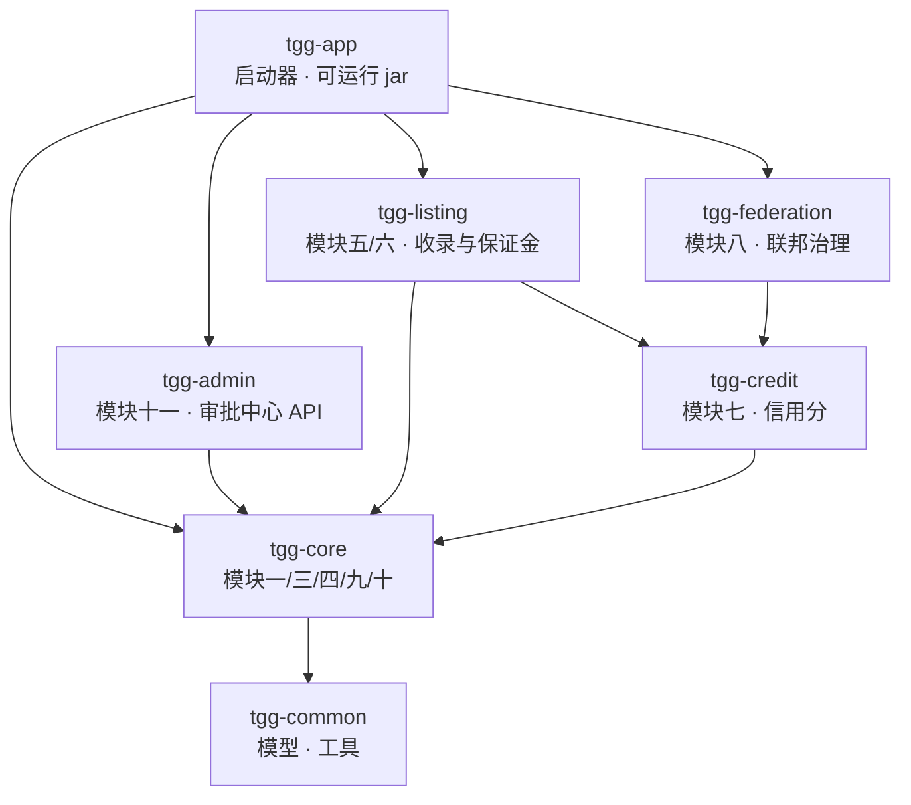
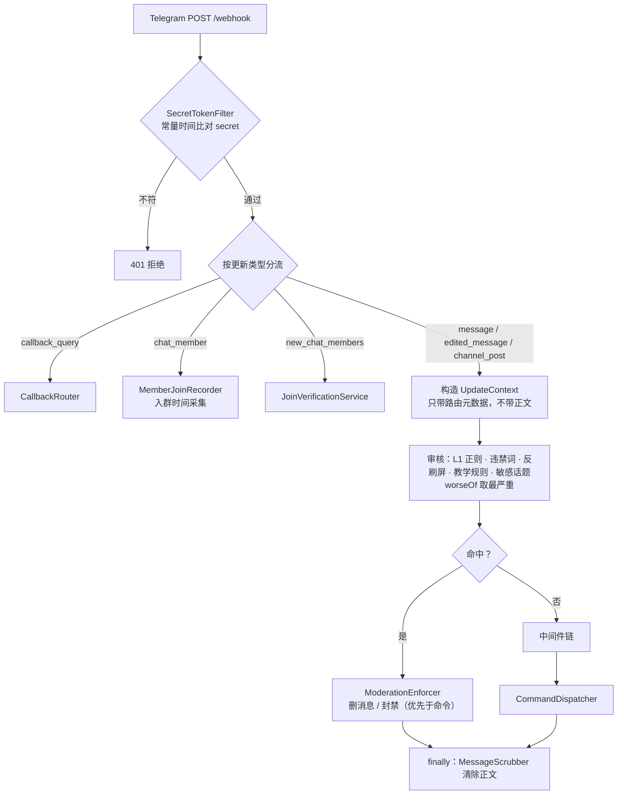

# 架构文档（ARCHITECTURE）

> 面向**开发者与审计者**：系统由哪些部分组成、一次更新如何流动、关键决策**为什么**这样做。
> 使用说明见 `README.md`，安全设计见 `SECURITY.md`，合规边界见 `COMPLIANCE.md`。

## 一、定位与治理哲学

**群主自治管群，联邦守住底线。**

- **群内事务**（违禁词、教学规则、功能开关）由**群管理员**经命令决定，机器人只执行；
- **跨群底线**（硬红线冻结、联邦标记）由**平台层**兜底，不依赖任何单个群主的意愿。

项目定位是**开源软件**：开发者交付代码与文档，**不参与运营**——不提供资金托管、不做制裁筛查、
不做 KYC（逐条见 `COMPLIANCE.md` 开篇的「本项目没有做什么」）。

## 二、模块划分与依赖方向

7 个 Maven 模块，依赖严格单向（各模块 `pom.xml` 实证）：



| 模块 | 职责（对应原文模块） |
|---|---|
| `tgg-common` | 领域模型（`UpdateContext`）、异常、工具（`IdHasher`）。**无业务逻辑** |
| `tgg-core` | Webhook 接入、中间件链、命令分发、RBAC、限流、审核流水线、违禁词、反刷屏、准入、教学规则、通知、审计、保留策略、泄露通报（一/三/四/九/十） |
| `tgg-credit` | 三套信用分、规则引擎、Ed25519 处罚令（七） |
| `tgg-federation` | 对等节点广播、入站验签、跨群封禁、申诉（八） |
| `tgg-listing` | 群组收录、商家收录与保证金（五/六） |
| `tgg-admin` | 审批中心 REST API + `frontend/` Vue 3 控制台（十一） |
| `tgg-app` | Spring Boot 启动器：把各模块放进组件扫描范围，打成单一 jar |

`tgg-core` 体量最大（143 个源文件——判据 `find tgg-core/src/main/java -name '*.java' | wc -l`），因为「模块一」本身就是横切的接入与调度层。
业务模块一律不反向依赖。

## 三、一次更新的生命周期

`UpdateDispatcher.dispatch`（`tgg-core/.../dispatch/UpdateDispatcher.java`）是唯一入口，Bot 库的
updateHandler 指向它。**顺序本身是设计**：



### 为什么是这个顺序

1. **审核必须在清除正文之前**——那是正文仍在内存中的唯一时机。审核产出 `ModerationVerdict`（不含原文），
   之后才可以安全地挂到上下文进入后续链路。
2. **清除放在 `finally`**——异常路径才是最容易被日志带出正文的那条。
3. **违规处置优先于命令执行**——否则「既违规又带命令」的消息会先被执行、再被删除，本末倒置。
4. **正文口径两端必须一致**——`MessageScrubber` 把 `text` 与 `caption` 都当正文，审核端也必须都看；
   否则带 caption 的图片消息会因 `getText()` 为 null 被判成「审过且干净」（**假 clean**，比没审更危险）。
   同理覆盖投票（问题/选项/增删事件）、地点（标题/地址）、链接预览 URL。
5. **命令豁免的判据是「真的会执行」，不是「看起来像命令」**——若拿 `message.isCommand()` 当豁免依据，
   任何人发 `/任意词 <违规内容>` 就能绕过审核（命令不执行、违规内容却留下）。故用
   `commandDispatcher.willExecute(ctx)`（已注册 + 有权限 + 群开关允许）。
6. **`edited_message` 与 `channel_post` 必须一起审**——「先发干净内容过审、再编辑成广告」是真实绕过手法。

## 四、中间件链与权限

`MiddlewareChain`（不可变、可并发复用）按注册顺序串行，任一返回 `false` 即中断：

```
AuthenticationMiddleware → GroupConfigMiddleware → RateLimitMiddleware
```

| 中间件 | 职责 |
|---|---|
| `AuthenticationMiddleware` | 填充身份信息 |
| `GroupConfigMiddleware` | 群开关：未 `/enable` 的群一律拒绝（恢复类命令除外） |
| `RateLimitMiddleware` | 三级限流：**用户 / 群 / 全局**各一个令牌桶（`InMemoryRateLimiter`） |

**权限模型**是自研的（**未引 Spring Security**）：`Permission{NONE, BAN_USER, MANAGE_CONFIG, TEACH_RULE}`，
由 `PermissionChecker` 判定，来源为 `RoleSource`（群内管理员经 `TGG_PERMISSION_ADMINS` 配置，
格式 `<chatId>:<userId>[:role]`）。

两个刻意的设计：`TGG_PERMISSION_ADMINS` 为空时**所有管理命令对任何人不可用**（门控只拒不放，启动 WARN）；
`CommandDispatcher` 必须注入真实判定器——单参构造器会落到「恒最小权限」的兜底实现，使门控**完全不生效**。

## 五、数据模型

Schema 由 Flyway 管理（15 个迁移，`ddl-auto: validate`——JPA 只校验不建表）。20 张表按模块归属：

| 归属 | 表 |
|---|---|
| core | `group_configs`、`banned_words`、`moderation_review_queue`、`moderation_rules`、`group_topic_tags`、`sensitive_topic_strikes`、`notification_preferences`、`notification_deferred`、`audit_log`、`data_breach_incident`、`member_join_observations` |
| credit | `credit_scores` |
| federation | `federation_appeals`、`federation_penalties` |
| listing | `listing_groups`、`listing_appeals`、`listing_verification_records`、`merchants`、`merchant_deposits`、`merchant_deposit_records` |

**消息正文零存储**：表内没有承载正文的字段。`audit_log` 在应用层**无删除入口**（刻意，合规留痕）。

## 六、扩展点（接缝）

| 接缝 | 位置 | 现状 |
|---|---|---|
| `ModerationLayer` | `core/moderation/` | L1 正则已实现；`LocalModelLayer`（L2/L4）、`DeepSeekLayer`（L3）是**接入位**，默认关闭 |
| `DepositGateway` | `listing/` | `NoopDepositGateway` —— TON 链上能力**未实现**（模块十二为既定非目标） |
| `TeachGate` | `core/wordfilter/` | 三条教学门槛（无违规 / 无扣分 / 入群时长）已实现，聚合器 `TeachEligibility.composite` |
| `CreditEventSink` | `core/credit/` | 未装配时为 noop，主链路零影响 |
| `ApprovalSource` | `tgg-admin/` | 审批中心目前只聚合复核队列（另三个来源在本项目无数据源） |
| `SubmitterNotifier` | `listing/notify/` | 收录下架通知：有 bot token 走真实投递，否则日志实现 + 启动 WARN |

## 七、与原文的关键口径对照

原文有三处措辞**看似冲突或规格缺失**。这里给出本项目的**取法与依据**，便于审计者对照——
避免「读原文以为没实现」或「读代码以为违背原文」。

### 7.1 硬红线：「立即冻结」与「100% 人工复核」并不冲突

原文 §10.8 同时写了「立即冻结（删除+封禁，**不等复核**）」（第 6 条）与「硬性红线 **100% 人工复核**」（第 8 条）；
而第 6 条自己还写了「联邦快速复核（**2 小时内**人工确认）」。

本项目把两者理解为**同一件事的两个侧面**，并分别落实：

| 原文表述 | 代码对应 | 含义 |
|---|---|---|
| 不等复核 / 立即冻结 | `ModerationVerdict.shouldFreezeImmediately()`（= `hardLine`） | 处置**动作**的时序：先冻结，不等批准 |
| 100% 人工复核 | `ModerationVerdict.needsReview()`（= `riskLevel != NONE`，硬红线**同样为真**）→ `ModerationReviewQueueService.record(…)` 带 `hardLine` 入队 | 监督**全覆盖**：每条都有人看，且可被操作员**推翻**（解封） |

即 **动作即时、监督全覆盖**——这是唯一能同时满足「法律底线即时响应」与「人工监督强制化」的读法。
若改成「先审后冻」，属产品行为变更（红线涉及儿童色情等法律底线，延迟冻结的风险高于误封——而误封有推翻权兜底）。

### 7.2 收录验证三态：`ERROR` 不重试、`FAIL` 不刷新 `lastVerifiedAt`

设计文档（`module5-6-listing-design.md` §3.2）定义三态 `OK / FAIL / ERROR`：

| 结果 | 行为 | 依据 |
|---|---|---|
| `OK` | 更新 `lastVerifiedAt`、`failCount` 归零 | 该字段是「最后一次**验证成功**」的时间 |
| `FAIL` | 退避重试 2 次（间隔 5 分钟）；仍失败 → `failCount++`；**只更新 `updatedAt`，不碰 `lastVerifiedAt`** | 否则会丢失「上次确认有效是什么时候」——而那是判断「它可能已经挂了多久」的关键信息 |
| `ERROR` | **不重试**、不改动任何业务状态（仅落一条验证记录） | `ERROR` 表示**探测层**不可用（无 token / 网络不通 / 限流）；再等 5 分钟通常同一结论，只会把一轮任务拖成小时级。且它**不影响 `failCount`** → 不会误判下架 |

> 本模块**最危险**的失败模式是「把网络抖动误判成群失效而误下架」，三态分离正是为此。

**`ERROR` 的代价与补偿**：正因为它不改状态，一直 `ERROR` 的条目会**永远安静地**停在 `ACTIVE`——
既有流程发现不了（而一直 `FAIL` 的会累积到 `SUSPENDED`）。故每轮验证末尾补一条**只告警不处置**的检查：
`status=ACTIVE` 且「最后一次成功验证（或创建）早于 `now - tgg.listing.stale-verify-days`（默认 3 天）」
的条目会被打 `WARN` 并列出 id（`ListingGroupService.staleAmong`）。基准取 `lastVerifiedAt`，
从未成功过的回落到 `createdAt`——否则「提交后一直没验成功」这类最该被发现的条目反而漏掉。

### 7.3 「大额扣分需双人审批」——**未实现**（规格缺失）

原文 §12.2 的约束要求「大额扣分需双人审批」，但**全文未定义「大额」是多少分**（§10.5 只给了敏感话题的
5 / 15 / 30 分档）。当前实现是模块七的**即时**扣分（`CreditService.apply`），跨阈值即触发
`WARN_BELOW=60` / `MUTE_BELOW=30` / `FEDERATION_AT_OR_BELOW=0`。

因此**未实现**该约束：① 阈值无据可依；② 扣分与阈值处置强耦合，挂起会让全部处置延后，
而信用分的价值正在于即时反馈。**这是需要产品决策的未实现项，不是遗漏**。

> **已拍板（2026-09-19）**：采纳「本阶段不做」。若将来要做，最小可行形态是「**单次扣分**达到某阈值才
> 挂起，且不阻断该用户既有的处置状态」——**前置条件是先定义该阈值**（原文只给了 §10.5 的
> 5 / 15 / 30 分档可作量级参考）。

## 八、已知边界（未实现，非遗漏）

- **Web 界面已交付**：`frontend/`（Vue 3 + TypeScript + Element Plus）覆盖模块十一的待办列表 / 详情 /
  裁决 / 统计卡，独立静态站点 + 反向代理（**不经 Spring Boot 托管**）。⚠️ **渲染未经真实浏览器验证**。
- OpenAPI 文档（springdoc 2.9.1）已引入、**默认关闭**（`TGG_OPENAPI_ENABLED`）；启用会暴露全部端点清单
  ——含第三方 TelegramBots 的 `/{botPath}`，属信息面。
- **模块十二 TON 担保交易整体未实现**：链上不可达（Tolk 合约 / 第三方审计 / OFAC-KYC 均不在范围内）。
- **无分布式协调**：`@Scheduled` 任务在多副本下会重复执行（未引 Redis）。
- **风控类能力未实现**：设备指纹、行为序列、图计算、AI 蜜罐（原文 §15.2 列为远期项）。

> 本地开发资产（`docs/` 目录下的 `KNOWN-ISSUES.md`、`LESSONS.md`、`DEPLOYMENT-VERIFICATION.md` 等）
> **不进 git**——换机器或重新 clone 不会带上它们，详见项目根 `.git/info/exclude`。
