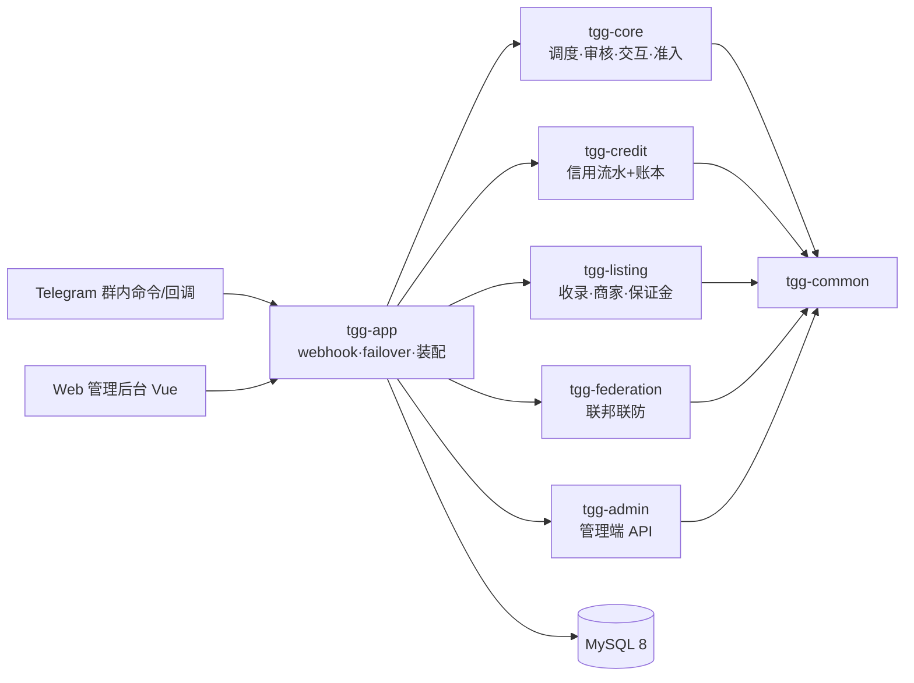
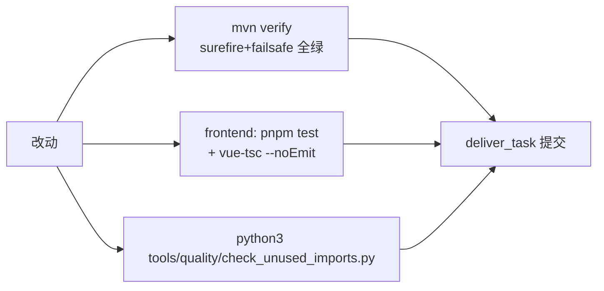

# 开发手册（项目现状单一快照）

> **本文定位**：全部开发文档的整合入口——把散落在 README / ARCHITECTURE / 各 GUIDE / KNOWN-ISSUES / DEPLOYMENT-\* 中的**当前有效信息**收敛为一份，供开发/运维快速建立全貌。
> **快照时点**：截至提交 `2285355`（2026-09-23）。此后行为变更须**回写本文**并同步专册（维护纪律见文末）。
> **专册不废**：合规五件套与运维专册（见 §9 索引）仍是各自领域的事实源，本文只收「开发需要知道的现状」并指路；两者冲突时以专册为准并立刻订正本文。

---

## 1. 项目是什么

Telegram 联邦智能治理 Bot（TGG）——面向「联邦-群组-商家」三层治理场景的 Telegram 群治理与配套 Web 管理后台：

- **群内治理**：违禁词/正则/敏感分级多层审核、反刷屏、入群验证与观察期、复核队列（低风险自动处置、中高风险人工裁决）、案件申诉与推翻退分、硬红线冻结/封禁。
- **信用体系**：个人/群组/商家三套分共用一套流水+账本（模块七），处罚令 Ed25519 签名。
- **收录体系**：群组收录与商家收录（模块五/六），商家入驻/保证金/结算/评级。
- **联邦治理**（模块八）：跨群联防、处罚上报联邦裁决、联邦申诉。
- **Web 管理后台**（模块十一）：待办审批、审计、配置中心、我的收录、账号管理、信用查询。



## 2. 模块地图（Maven 多模块，Java 21 / Spring Boot 3.5）

| 模块 | 职责 | 关键约束 |
|---|---|---|
| `tgg-common` | 基础工具/模型（UpdateContext、IdHasher 等） | 无业务语义 |
| `tgg-core` | 调度（CommandDispatcher/UpdateDispatcher）、审核管线、命令交互、准入验证、failover、动态配置 | 豁免判据（exemptFromModeration/willExecute/resolvableHandler）是审核防线，改动须带「publicCommand 文本仍送审」回归 |
| `tgg-credit` | 信用流水（credit_events）+ 账本（credit_scores）、规则引擎、处罚令签名 | `score_after` 预测必须与写库语义逐字对齐（`nextScoreAfter`）；退分走 `reverseOf` 且拒退补偿流水 |
| `tgg-listing` | 群组/商家收录、入驻/保证金/结算、评级 | 商家退出语义=只冻结保证金不改 status（有意契约，KNOWN-ISSUES #18） |
| `tgg-federation` | 联邦处罚上报/裁决、联邦申诉 | 申诉终态守卫：已结案不可再裁（2026-09-22 修复，守门 `FederationAppealServiceTest`） |
| `tgg-admin` | Web 管理端 API（auth/accounts/approvals/config/audit/my/credit/dangerous-actions） | 鉴权 fail-closed（AdminSessionFilter）；能力点制（如 CREDIT_READ） |
| `tgg-app` | Spring Boot 装配、webhook 入口、集成测试（\*IT 全在此） | 全上下文启动测试在此；\*IT 由 failsafe 在 verify 阶段跑 |
| `frontend` | Vue 3 + Element Plus 管理后台（待办/审计/配置/我的收录/账号/信用） | 文案改动必须同步 `client.test.ts` 的逐字断言 |

**规模快照**（实测）：主源 Java 325 个 / 测试 Java 191 个 / Flyway 迁移 V1–V23 / 动态配置键 62 个。

## 3. 功能面现状

### 3.1 Telegram 群内（命令清单以 `USER-GUIDE.md` 为准）

- **治理**：审核命中按风险分级处置，硬红线走冻结/封禁并上报联邦；中高风险入人工复核队列（`/review_list`·`/review_approve`·`/review_reject`）；裁决可申诉，推翻即按原流水实际变化退分（防套娃：补偿流水不可再退）。
- **信用**：`/merchant_status` 回执含商家本人信用分；信用事件幂等（同键重投不重复扣分）；无键事件不去重但流水预测已与写库语义对齐。
- **收录**：商家入驻/退出/保证金/结算、群组收录；退出=冻结保证金、status 保持 ACTIVE（契约钉住）。
- **交互**：`/help`·`/menu` 私聊群聊分头渲染；**未注册/误拼命令回友好提示**（指向 /menu）；危险操作出确认卡（nonce 原子消费，防双执行）；webhook 重投按 update_id 有界 TTL 去重（防二次分发）。
- **公共命令（publicCommand）**：共 16 处注册行；其文本**仍送审核**（豁免面仅权限命令 ∪ 申诉白名单）。

### 3.2 Web 管理后台（六页）

| 页面 | 能力 | 备注 |
|---|---|---|
| 待办中心 | 复核队列审批 + 决定抽屉 | 加载失败显示错误横幅（不再假空表） |
| 审计 | 审计流水只读查询 | 未授权 403 态 |
| 配置中心 | 热参数可写/装配开关只读 | 密钥类只回显「已设/未设」；失败清除也进审计 |
| 我的收录 | 本人提交的收录 | 后台账号通常为空（定位声明，非缺陷） |
| 账号管理 | 账号 CRUD/停用/强制下线/密码/TOTP | 停用与强制下线有二次确认 |
| 信用查询 | credit_events 流水 + credit_scores 账本（分页+主体过滤） | CREDIT_READ 能力点管控，无会话 401/无权限 403 |

## 4. 开发与验证（三门禁缺一不可）



1. **后端**：`mvn -B -ntp verify`（surefire 只跑 \*Test，\*IT 由 failsafe 在 verify 阶段跑——单独 `test` **不会**跑 IT）。本机全量验证 env 配方（权威值取自 `.github/workflows/ci.yml`）：

   ```bash
   TGG_TEST_DB_USER=root TGG_TEST_DB_PASSWORD= \
   TGG_TEST_WEBHOOK_SECRET=ci-test-secret TGG_TEST_BOT_TOKEN=ci-test-bot-token \
   TGG_TEST_PERMISSION_ADMINS=-777003:42:ADMIN \
   mvn -B -ntp verify
   ```

   `TGG_TEST_PERMISSION_ADMINS` 格式 `<chatId>:<userId>[:role]`（可省 role 缺省 ADMIN）；值错则 roleSource 启动失败、上下文装载测试大面积红——那是环境配置错，不是代码缺陷。`ConfigSwitchEndToEndIT` 硬编码该三元组，勿改全局 env 去迁就个别夹具。
2. **前端**：`cd frontend && pnpm test && pnpm exec vue-tsc --noEmit`。UI 文件改动交付前应做渲染验证（本仓可用 `frontend/tools/screenshot-probe.mjs`；无浏览器通道时必须显式标注「渲染未验证」）。
3. **质量门禁**：`python3 tools/quality/check_unused_imports.py`（判据：import 简单名在代码+javadoc+字符串零出现）。
4. **测试纪律**：bugfix 先复现（RED 来自断言层）再修（GREEN）；check-then-act 并发缺陷用「闸门时钟」（CyclicBarrier 卡在检查与取走之间）造确定性 RED；行为语义不信接口签名，读实现或打微探针。
5. **单模块构建**：`mvn -pl tgg-credit -am` 必须带 `-am`——单模块会从本地仓库解析到陈旧兄弟产物（实测踩过 NoSuchField）。

## 5. 配置与开关

- **装配开关**（默认关，`@ConditionalOnProperty` 门控）：`tgg.listing.enabled`、`tgg.merchant.enabled`、`tgg.credit.enabled`、`tgg.admission.enabled`、`tgg.failover.enabled`、`tgg.moderation.sensitive-grading.enabled` 等；**相互独立**（如 `/merchant_status` 需要 listing+merchant 同开）。开关打开伴随 fail-fast 密钥要求（如 credit 开启必须配 Ed25519 `TGG_CREDIT_PRIVATE_KEY`）。
- **动态配置**：62 键入 `ConfigCatalog`（不登记不进配置中心）；「热生效」声明与实际读取方式由 `ConfigCatalogTest` 静态护栏对账（@ConfigurationProperties 启动期绑定的键=需重启）。
- **关键 env**：`TGG_WEBHOOK_SECRET`、`TGG_BOT_TOKEN`、`TGG_DB_URL`（含 `&` 必须加引号，否则静默落默认库）、`TGG_HASH_SALT`、`TGG_PERMISSION_ADMINS`、`TGG_CREDIT_PRIVATE_KEY` 等——全清单与三条实测坑见 `DEPLOYMENT-RUNBOOK.md` 0.1/0.2 与 `tools/deploy/all-on.env.example`。

## 6. 部署（生产实况）

- **形态**：宝塔面板 Java 项目（Spring Boot fat jar），单机；Nginx 反代域名 → `:8080`；MySQL 同机。
- **换版配方**（实测走通，整包上传因链路吞吐被否——勿重蹈）：服务器侧 `git pull` → `JAVA_HOME=/www/server/java/jdk-21.0.2 …/mvn -DskipTests -Dmaven.repo.local=/www/wwwroot/tgg/build/m2repo package`（该机 `/root/.m2` 不可建仓）→ 解嵌套 `BOOT-INF/lib` **二进制 grep 新标记**核验产物 → 落盘 `/www/wwwroot/tgg/tgg-app-0.1.0-<commit>.jar` → `start.sh` 备份（`start.sh.bak-<commit>`）后改 `exec -jar` 一行 → 宝塔重启 → 验 pid/cmdline/health（`/actuator/health`）/日志 ERROR 按 pid 归因。
- **回滚**：`cp start.sh.bak-<commit> start.sh` + 重启；旧 jar 原地保留。
- 详细记录与历史回滚点：`DEPLOYMENT-RECORDS.md`；验证清单：`DEPLOYMENT-VERIFICATION.md`。

## 7. 已知缺口与已定决策（速览；`#n`=KNOWN-ISSUES 条目，`GUARD-n`/`gap-n`=2026-09-22 星域议事会条目**未入台账**、以本表描述为准）

| 项 | 状态 | 要点 |
|---|---|---|
| 三表 status 索引（#14） | 定论不加 | 2 万行造数实测：绝对代价 0.01s/天；>20 万行复测再加 |
| 无键事件 score_after 失真（#16） | 已修 | 预测与写库语义逐字对齐（`nextScoreAfter`）；历史失真无键行不可回溯（不可寻址） |
| compose 时区口径（#17） | 反证不成立 | 全 DATETIME(6)+无 server 侧时间函数；引入 NOW()/TIMESTAMP 列时复访 |
| 商家退出状态机（#18） | 契约钉住 | 退出=冻结保证金不改 status（有意）；要退出态时重开 |
| GUARD-2 配置注入失败 | 喧闹 fail-open | ERROR 警告块；升级「拒绝启动」需同步 ConfigBootOverrideIT 契约 |
| GUARD-6 发送失败观测 | 只到日志+内存计数 | 建议接 metrics/告警端点 |
| gap-07 处罚历史查询 | 未做 | 群主/复核人只能看待审；可并入信用页或加 `/review_history` |
| 水平扩展 | 未支持 | @Scheduled 多副本重复执行（无分布式锁）；单实例假设 |
| 容器镜像 OS 层扫描 | 未做 | 现仅 SBOM 扫 Java 依赖；基础镜像需 trivy/grype |

## 8. 重要护栏（改动前必读）

- **审核豁免判据**、**ConfirmationStore 原子消费**、**幂等键契约**（null=不去重、行不可寻址）、**fail-closed 鉴权**（AdminSessionFilter）——改这四处必须带回归测试，历史缺陷均出自这里。
- 测试构造 update 必须给**唯一 update_id**（各类独立 AtomicInteger 基数）——去重落地后全仓 15 处硬编码 id 已适配，新测试勿再写死。
- TelegramBots 类型包路径：`objects.chat.Chat`、`objects.message.Message`、`objects.EntityType`（新拆包），照 `MerchantRefundIT` 的 import 抄。
- `@BotCommand` 与 TelegramBots 同名类不同物——core 的测试里勿 import 后者（遮蔽编译错）。

## 9. 文档索引（专册职责一览）

| 文档 | 职责 |
|---|---|
| `README.md` | 项目门面、快速开始 |
| `ARCHITECTURE.md` | 架构与模块设计 |
| `USER-GUIDE.md` | 群内命令全表与角色可用面 |
| `ADMIN-GUIDE.md` | Web 后台操作手册 |
| `CONTRIBUTING.md` | 贡献流程、功能对账表 |
| `VOICE.md` | 文案语气规范（守门测试同源） |
| `COMPLIANCE.md` / `PRIVACY.md` / `SECURITY.md` / `TERMS.md` / `DISCLAIMER.md` / `DPIA-TEMPLATE.md` | 合规六件套（独立交付物，不并入手册） |
| `DEPLOYMENT-RUNBOOK.md` | 部署手册（env 全清单+实测坑） |
| `DEPLOYMENT-RECORDS.md` | 部署/回滚史实记录 |
| `DEPLOYMENT-VERIFICATION.md` | 部署验证清单与记录 |
| `KNOWN-ISSUES.md` | 问题台账（定性/定论/复访条件，本地笔记区） |
| `docs/CODE-REVIEW-*.md` | 审查记录（本地笔记区） |
| `docs/superpowers/specs/*.md` | 模块设计规格（历史设计基线） |

## 10. 文档维护纪律（血泪换来的）

1. **一源多泄**：改任何行为/口径后，`grep -rni <旧口径关键词> --include="*.md"` 全库对账并**逐处**订正——改一处漏七处是本仓实测踩过的坑（大小写必须 `-i`）。
2. **「唯一/最」断言先核对**：写「唯一默认开启」「最早的」之前先 grep 同类对象，本仓 README 与 ConfigCatalog 都踩过「唯一」失真。
3. **数字必须回指**：本文所有规模/测试数字都可复现（§4 命令重跑即得）；新增数字同样要求能指到一条验证记录。
4. **本快照随行为更新**：行为变了先回写 §3/§5/§7 再提交；「已修复/已验证」的措辞必须有 RED→GREEN 或实测记录背书。
