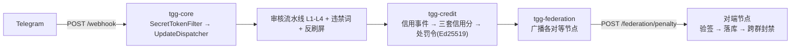

# Telegram 联邦智慧政务群组治理机器人（TGG）

一个基于 Telegram 的**群组治理机器人**：群主自治管群，联邦守住底线。Java 21 + Spring Boot 多模块工程。

> 定位：**开源项目**。开发者只交付代码 / 文档 / 许可证 / 免责声明，**不参与运营**；运营者自行申请资质并承担合规责任。

> ⚠️ **部署形态：单实例**。本系统当前**只支持单实例部署**——限流器、确认令牌、准入登记、群配置/词表缓存均为**进程内内存态**，`@Scheduled` 任务无分布式锁。横向扩展（多副本同时服务同一群）会导致限流失效、确认卡/验证按钮跨实例失效、定时任务重复执行。多实例支持须先引入共享协调层（如 Redis），属后续增量。

## 技术栈

| 项 | 取值 |
|---|---|
| 语言 / 构建 | Java 21 / Maven 多模块 |
| 框架 | Spring Boot **3.5.16** |
| Bot 库 | TelegramBots **10.3.0**（坐标 `telegrambots-springboot-webhook-starter`） |
| 持久化 | MySQL + Flyway（schema 由 Flyway 管理，JPA 侧 `ddl-auto: validate`） |
| 加解密 | 标识哈希 HMAC-SHA256（`IdHasher`）；处罚令签名 **Ed25519** |

## 模块结构

```
tgg-common      共享：领域模型、异常、工具（无业务逻辑）
tgg-core        模块一：Webhook 接入 / 中间件链 / 命令分发 / 限流 / 权限 / 审核 / 准入
tgg-credit      模块七：信用分体系（三套信用分 / 规则引擎 / 处罚令）
tgg-federation  模块八：联邦治理（对等节点广播 / 入站验签 / 跨群封禁 / 申诉）
tgg-listing     模块五/六：收录（群组收录 / 商家收录与保证金）
tgg-admin       模块十一：Web 后台（审批中心 REST API + frontend/ Vue 3 控制台）
tgg-app         Spring Boot 启动器（打成单一可运行 jar）
```

依赖单向：`tgg-app` 依赖各业务模块，业务模块依赖 `tgg-core`，`tgg-core` 依赖 `tgg-common`
（即 `tgg-app → {federation, listing, admin, credit} → core → common`）；反向依赖不存在。



## 快速开始

**前置**：JDK 21、Maven 3.9+、MySQL（库字符集 `utf8mb4`，Telegram 消息常含 emoji）。

集成测试连**独立库** `tgg_test`，与运行库隔离（测试会用 `deleteAll()` 重置数据，
URL 带 `createDatabaseIfNotExist=true`；若无建库权限，需管理员先建库并授权）。

```bash
mvn -B -ntp verify        # 构建 + 全量测试（*IT 由 failsafe 在 verify 阶段执行）
```

> **测试用环境变量**：测试配置一律通过占位符读取环境变量，**仓库中不含任何字面凭据**。
> 跑集成测试前需提供（值自定，仅用于本地测试库）：
> `TGG_TEST_DB_USER`、`TGG_TEST_DB_PASSWORD`、`TGG_WEBHOOK_SECRET`、`TGG_BOT_TOKEN`。
> 缺少时相关测试无法启动——这是刻意的 fail-fast。

### 本地运行

```bash
export TGG_WEBHOOK_SECRET="$(openssl rand -hex 32)"   # 必需：缺失即启动失败
export TGG_DB_PASSWORD="<你的数据库密码>"              # 无默认值，缺失即连接失败
java -jar tgg-app/target/tgg-app-0.1.0-SNAPSHOT.jar
```

### 容器化运行（Docker / Compose）

```bash
export TGG_WEBHOOK_SECRET="$(openssl rand -hex 32)"   # 必需：缺失即启动失败
export MYSQL_ROOT_PASSWORD="<强随机>"
export TGG_DB_PASSWORD="<强随机>"
docker compose up -d --build
docker compose logs -f app     # 期望：末行 Started TggApplication in N.NNN seconds
```

`Dockerfile` 是多阶段构建（Maven 构建 → JRE 运行，**非 root**，uid 10001）；
`docker-compose.yml` 编排应用 + MySQL，数据库端口**只绑 `127.0.0.1`**。

容器 `HEALTHCHECK` 探 **`/actuator/health`**（真实业务就绪，含 DB 连通性）——
DB 不可达时它返回 503，容器随之判为 unhealthy；应用只暴露 health，其余 Actuator 端点一律关闭。
⚠️ **CSP / HSTS 归反向代理层**：HSTS 必须由 TLS 终止方下发，CSP 约束的是前端静态站。

### 服务器选型（参考）

应用与 MySQL 同机建议 **2 vCPU / 4 GB 内存 / 20 GB 磁盘**；
MySQL 用托管实例（应用单独部署）时 **1 vCPU / 1 GB** 足够。

其余要求：Linux（x86_64 / arm64 皆可）+ Docker / Compose；
入站 **80 / 443**（Telegram webhook **强制 HTTPS**）、出站可达 `api.telegram.org`；
**建议 `TZ=UTC`**（免打扰时段按服务器时区解释，跨时区部署须统一）。

## 配置（环境变量）

**必需**（缺失即启动失败，属刻意的 fail-fast）：

| 变量 | 说明 |
|---|---|
| `TGG_WEBHOOK_SECRET` | Webhook 的 `X-Telegram-Bot-Api-Secret-Token` 校验值（常量时间比对） |
| `TGG_DB_PASSWORD` | 数据库密码。**无默认值**——绝不用开发密码兜底 |
| `TGG_BOT_TOKEN` | Bot token。主动调用（准入验证、硬红线封禁、下架通知私聊、链接探针）需要；缺失时这些能力**各自显式降级并 WARN**，不静默 |

**数据库**：

| 变量 | 默认 |
|---|---|
| `TGG_DB_URL` | `jdbc:mysql://localhost:3306/tgg?...` |
| `TGG_DB_USER` | `tgg` |

**各模块开关**（除注明外均**默认关闭**，不启用即整组组件不装配）：

| 变量 | 默认 | 说明 |
|---|---|---|
| `TGG_PERMISSION_ADMINS` | 空 | 群内管理员授权，格式 `<chatId>:<userId>[:role]`。**为空则所有管理命令对任何人不可用**（启动会 WARN） |
| `TGG_HASH_SALT` | 空 | 标识哈希用盐。不设会退回开发兜底盐（userId 空间小，固定盐可被枚举反推） |
| `TGG_COMMAND_MENU_ENABLED` | **`true`** | 启动期把命令清单**按权限分档**注册到 Telegram（客户端输入 `/` 时的提示菜单）：默认档只含声明了 `@BotCommand(publicCommand = true)` 的公开命令；`TGG_PERMISSION_ADMINS` 里每条授权额外得到一档 `BotCommandScopeChatMember`（公开命令 + 该角色确有权限的管理命令）。平台白名单类命令（复核/裁决等）**不进客户端菜单**（Telegram 无「全局按人」的 scope），由 `/menu` 卡片呈现。这是**唯一默认开启**的开关。缺 `TGG_BOT_TOKEN` 时跳过并 WARN；某档注册失败只 WARN、按档隔离，该档用户回落到默认档 |
| `TGG_FAILOVER_ENABLED` | `false` | Webhook 失效后降级长轮询 |
| `TGG_ADMISSION_ENABLED` | `false` | 入群验证 + 观察期；启用时要求 `TGG_BOT_TOKEN` |
| `TGG_AI_DEEPSEEK_ENABLED` | `false` | L3 云端审核；启用后**消息正文会发送至 DeepSeek**（详见 `PRIVACY.md`），缺 `TGG_DEEPSEEK_API_KEY` 即启动失败 |
| `TGG_CREDIT_ENABLED` | `false` | 模块七信用分；启用时缺 `TGG_CREDIT_PRIVATE_KEY`（Ed25519 PKCS#8 Base64 私钥）即启动失败 |
| `TGG_FEDERATION_ENABLED` | `false` | 模块八联邦；启用时 `TGG_FEDERATION_NODES`（`url\|公钥Base64`，逗号分隔）**为空即启动失败** |
| `TGG_FEDERATION_ADMINS` | 空 | 联邦管理员 userId（**全局**白名单，逗号分隔）；为空则 `/pending`·`/approve`·`/reject` 不可用 |
| `TGG_LISTING_ENABLED` | `false` | 模块五 · 群组收录；启用后 `/listing_add`·`/listing_list`·`/listing_appeal` 与每日链接验证任务才装配 |
| `TGG_LISTING_VERIFY_CRON` | `0 0 3 * * *` | 收录链接的定时验证 cron（到点扫描全库、连续 3 次失败转软删下架） |
| `TGG_MERCHANT_ENABLED` | `false` | 模块六 · 商家收录；启用后 `/merchant_*` 六个命令与保证金账本才装配 |
| `TGG_MERCHANT_REVIEWERS` | 空 | 资质复核人与保证金操作人 userId（**全局**白名单，逗号分隔）；为空则 `/merchant_review`·`/merchant_deposit` 对任何人不可用 |
| `TGG_MERCHANT_INITIAL_SCORE` | `500` | 商家入驻成功时写入的初始信用分（需同时 `TGG_CREDIT_ENABLED=true`） |
| `TGG_MODERATION_REVIEWERS` | 空 | 复核人 userId（**全局**白名单，逗号分隔）。为空则 `/review_list`·`/review_approve`·`/review_reject` 对任何人不可用 |
| `TGG_ADMIN_API_TOKEN` | 空 | 模块十一 · 审批中心后端的 `Bearer` 令牌。**为空则 `/admin/approvals` 端点整体不装配**（访问得 404） |
| `TGG_ADMIN_CONFIG_ADMINS` | 空 | 配置中心**写权限**白名单（userId，逗号分隔）。**为空则回落到 `TGG_MODERATION_REVIEWERS`**（即「能审批的人也能改配置」）；想让写权限比审批更严就显式设置本项 |
| `TGG_ADMIN_RESTART_ENABLED` | `false` | 是否允许经 Web 后台触发**优雅重启**。⚠️ 本功能只负责退出，**能否再起来取决于部署侧有无外部监管进程**（Docker restart / systemd / k8s）；裸 `java -jar` 下开启＝点了按钮就停服 |
| `TGG_OPENAPI_ENABLED` | `false` | 启用 Swagger / OpenAPI 文档（`/swagger-ui.html`、`/v3/api-docs`）。**默认关闭**——springdoc 会暴露全部端点清单，属信息面；启用后**不要裸露公网** |
| `TGG_MODERATION_SENSITIVE_GRADING_ENABLED` | `false` | 敏感话题分级：按群分级、受标签豁免。`/group_tag add\|remove\|list <标签>` 管理 |

> ⚠️ 值里含 `&` / `|` 的变量（`TGG_DB_URL`、`TGG_FEDERATION_NODES`）**必须加引号**——
> 否则 shell 会静默把它们设成空。

## 已实现 / 未实现

| 模块 | 状态 |
|---|---|
| 一 · 核心与基础设施（Webhook/分发/中间件/限流/RBAC/隐私管道/降级） | 已完成 |
| 三 · 群组管理（违禁词、反刷屏） | 已完成 |
| 四 · 准入与验证（入群验证、观察期） | 已完成（默认关闭） |
| 五/六 · 收录（群组收录、商家收录与保证金） | 已完成（默认关闭） |
| 七 · 信用分体系（三套信用分、流水与幂等、规则引擎、处罚令） | 已完成（默认关闭） |
| 八 · 联邦治理（对等广播、入站验签、跨群封禁、申诉） | 已完成（默认关闭） |
| 九 · AI 审核（L1 正则 + 四层流水线 + 复核队列；L2/L3/L4 默认关闭） | 已完成 |
| 十 · 通知与审计（三级分类 / 免打扰 / 全链路审计 / 保留策略 / 72h 泄露通报） | 已完成（默认关闭） |
| 十一 · Web 后台（审批中心后端 + Vue 3 控制台） | 已完成（默认关闭） |
| 十二 · TON 担保交易 | 未开始 |

## 相关文档

| 文件 | 内容 |
|---|---|
| `PRIVACY.md` | 隐私说明：消息原文零存储、日志脱敏、第三方 AI 送什么 / 不送什么 |
| `SECURITY.md` | 安全文档：认证 / 授权 / 隐私 / 输入安全 / 密钥管理 / 审计 / 部署加固，并明列**未实现**项 |
| `USER-GUIDE.md` | 用户手册：群主与成员的 Bot 使用指南（命令、权限、通知、隐私） |
| `DISCLAIMER.md` | 免责声明：只提供软件、不参与运营、无担保、责任限制 |
| `TERMS.md` | 服务条款**模板**（含占位符，运营者须按自身部署与法域改写并公开） |

## 许可

**AGPL-3.0**（GNU Affero General Public License v3.0）—— 全文见仓库根目录 [`LICENSE`](LICENSE)。

## 免责声明

本项目仅提供软件。运营者须自行确保其运营行为符合所在地法律法规（含数据保护、金融合规等），
并自行承担全部责任；开发者不参与运营、不提供担保。
