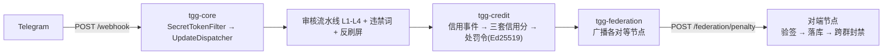
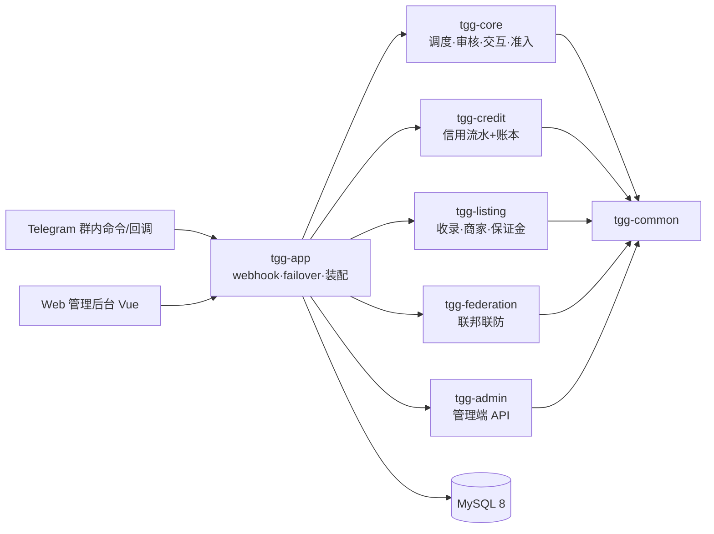
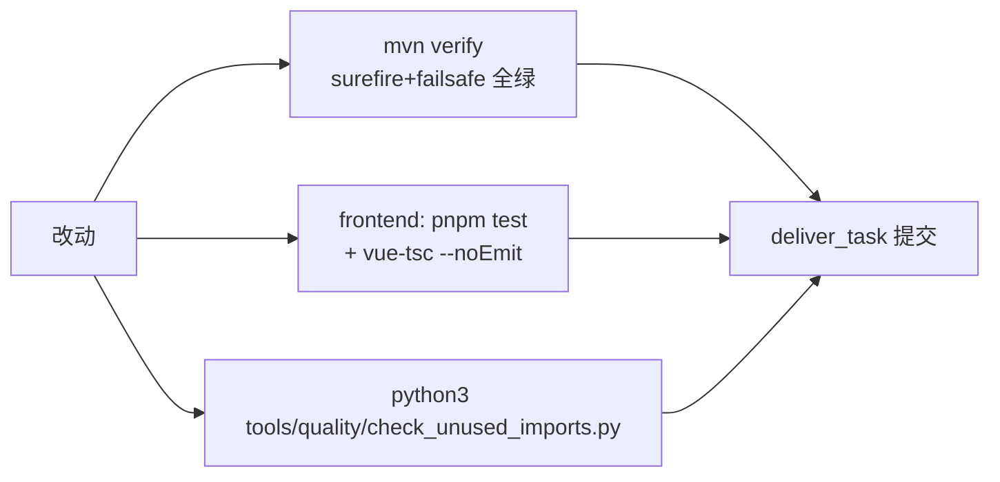
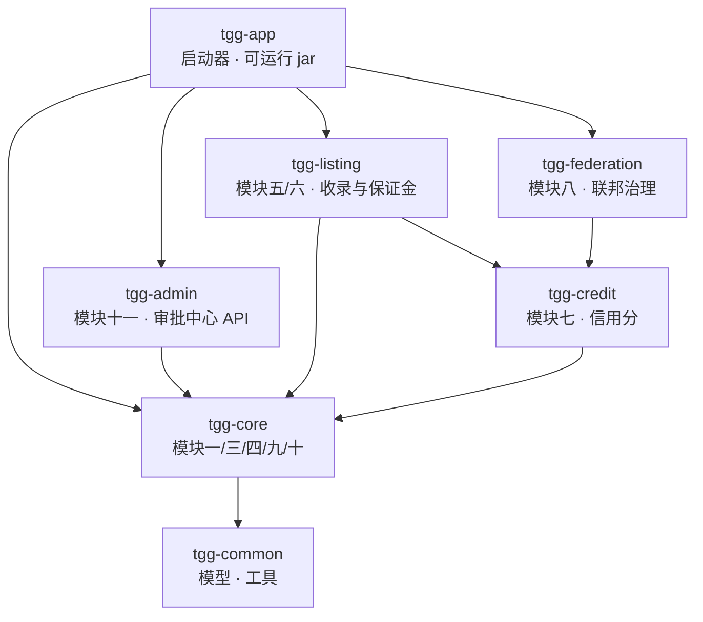
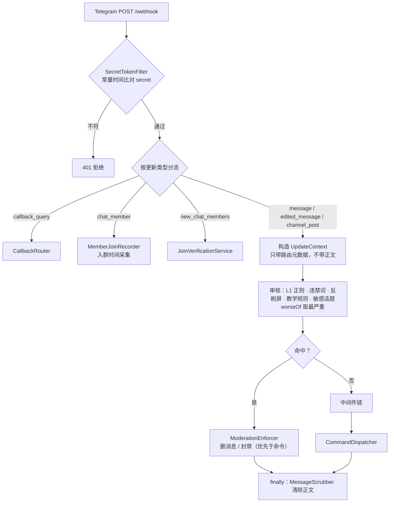

# TGG · Telegram 联邦智能治理 Bot

> 2026-09-23 文档合并产物：原 `README.md` + `DEVELOPMENT-HANDBOOK.md`（开发手册）+ `ARCHITECTURE.md`（架构）+ `CONTRIBUTING.md`（贡献）+ `ADMIN-GUIDE.md`（后台手册）五份合并为本册，内容逐字节搬运零删改。
> **目录**：第一部分=项目门面与快速开始；第二部分=开发手册（现状快照/模块/门禁/护栏）；第三部分=架构与模块设计；第四部分=贡献流程；第五部分=Web 后台操作手册。
> 命令全表见 `USER-GUIDE.md`（测试契约，独立保留）；部署见 `docs/DEPLOYMENT-HANDBOOK.md`；工程记录见 `docs/ENGINEERING-LOG.md`。

---

# 第一部分 · 项目门面与快速开始（原 README.md）

# Telegram 联邦智慧政务群组治理机器人（TGG）

一个基于 Telegram 的**群组治理机器人**：群主自治管群，联邦守住底线。Java 21 + Spring Boot 多模块工程。

> 定位：**开源项目**。开发者只交付代码 / 文档 / 许可证 / 免责声明，**不参与运营**；运营者自行申请资质并承担合规责任。

> ⚠️ **部署形态：单实例**。本系统当前**只支持单实例部署**——限流器、确认令牌、准入登记、群配置/词表缓存均为**进程内内存态**，`@Scheduled` 任务无分布式锁。横向扩展（多副本同时服务同一群）会导致限流失效、确认卡/验证按钮跨实例失效、定时任务重复执行。多实例支持须先引入共享协调层（如 Redis），属后续增量。

## 技术栈

| 项 | 取值 |
|---|---|
| 语言 / 构建 | Java 21 / Maven 多模块 |
| 框架 | Spring Boot **3.5.16** |
| Bot 库 | TelegramBots **10.3.0**（坐标 `telegrambots-springboot-webhook-starter`） |
| 持久化 | MySQL + Flyway（schema 由 Flyway 管理，JPA 侧 `ddl-auto: validate`） |
| 加解密 | 标识哈希 HMAC-SHA256（`IdHasher`）；处罚令签名 **Ed25519** |

## 模块结构

```
tgg-common      共享：领域模型、异常、工具（无业务逻辑）
tgg-core        模块一：Webhook 接入 / 中间件链 / 命令分发 / 限流 / 权限 / 审核 / 准入
tgg-credit      模块七：信用分体系（三套信用分 / 规则引擎 / 处罚令）
tgg-federation  模块八：联邦治理（对等节点广播 / 入站验签 / 跨群封禁 / 申诉）
tgg-listing     模块五/六：收录（群组收录 / 商家收录与保证金）
tgg-admin       模块十一：Web 后台（审批中心 REST API + frontend/ Vue 3 控制台）
tgg-app         Spring Boot 启动器（打成单一可运行 jar）
```

依赖单向：`tgg-app` 依赖各业务模块，业务模块依赖 `tgg-core`，`tgg-core` 依赖 `tgg-common`
（即 `tgg-app → {federation, listing, admin, credit} → core → common`）；反向依赖不存在。



## 快速开始

**前置**：JDK 21、Maven 3.9+、MySQL（库字符集 `utf8mb4`，Telegram 消息常含 emoji）。

集成测试连**独立库** `tgg_test`，与运行库隔离（测试会用 `deleteAll()` 重置数据，
URL 带 `createDatabaseIfNotExist=true`；若无建库权限，需管理员先建库并授权）。

```bash
mvn -B -ntp verify        # 构建 + 全量测试（*IT 由 failsafe 在 verify 阶段执行）
```

> **测试用环境变量**：测试配置一律通过占位符读取环境变量，**仓库中不含任何字面凭据**。
> 跑集成测试前需提供（值自定，仅用于本地测试库）：
> `TGG_TEST_DB_USER`、`TGG_TEST_DB_PASSWORD`、`TGG_WEBHOOK_SECRET`、`TGG_BOT_TOKEN`。
> 缺少时相关测试无法启动——这是刻意的 fail-fast。

### 本地运行

```bash
export TGG_WEBHOOK_SECRET="$(openssl rand -hex 32)"   # 必需：缺失即启动失败
export TGG_DB_PASSWORD="<你的数据库密码>"              # 无默认值，缺失即连接失败
java -jar tgg-app/target/tgg-app-0.1.0-SNAPSHOT.jar
```

### 容器化运行（Docker / Compose）

```bash
export TGG_WEBHOOK_SECRET="$(openssl rand -hex 32)"   # 必需：缺失即启动失败
export MYSQL_ROOT_PASSWORD="<强随机>"
export TGG_DB_PASSWORD="<强随机>"
docker compose up -d --build
docker compose logs -f app     # 期望：末行 Started TggApplication in N.NNN seconds
```

`Dockerfile` 是多阶段构建（Maven 构建 → JRE 运行，**非 root**，uid 10001）；
`docker-compose.yml` 编排应用 + MySQL，数据库端口**只绑 `127.0.0.1`**。

容器 `HEALTHCHECK` 探 **`/actuator/health`**（真实业务就绪，含 DB 连通性）——
DB 不可达时它返回 503，容器随之判为 unhealthy；应用只暴露 health，其余 Actuator 端点一律关闭。
⚠️ **CSP / HSTS 归反向代理层**：HSTS 必须由 TLS 终止方下发，CSP 约束的是前端静态站。

### 服务器选型（参考）

应用与 MySQL 同机建议 **2 vCPU / 4 GB 内存 / 20 GB 磁盘**；
MySQL 用托管实例（应用单独部署）时 **1 vCPU / 1 GB** 足够。

其余要求：Linux（x86_64 / arm64 皆可）+ Docker / Compose；
入站 **80 / 443**（Telegram webhook **强制 HTTPS**）、出站可达 `api.telegram.org`；
**建议 `TZ=UTC`**（免打扰时段按服务器时区解释，跨时区部署须统一）。

## 配置（环境变量）

**必需**（缺失即启动失败，属刻意的 fail-fast）：

| 变量 | 说明 |
|---|---|
| `TGG_WEBHOOK_SECRET` | Webhook 的 `X-Telegram-Bot-Api-Secret-Token` 校验值（常量时间比对） |
| `TGG_DB_PASSWORD` | 数据库密码。**无默认值**——绝不用开发密码兜底 |
| `TGG_BOT_TOKEN` | Bot token。主动调用（准入验证、硬红线封禁、下架通知私聊、链接探针）需要；缺失时这些能力**各自显式降级并 WARN**，不静默 |

**数据库**：

| 变量 | 默认 |
|---|---|
| `TGG_DB_URL` | `jdbc:mysql://localhost:3306/tgg?...` |
| `TGG_DB_USER` | `tgg` |

**各模块开关**（除注明外均**默认关闭**，不启用即整组组件不装配）：

| 变量 | 默认 | 说明 |
|---|---|---|
| `TGG_PERMISSION_ADMINS` | 空 | 群内管理员授权，格式 `<chatId>:<userId>[:role]`。**为空则所有管理命令对任何人不可用**（启动会 WARN） |
| `TGG_HASH_SALT` | 空 | 标识哈希用盐。不设会退回开发兜底盐（userId 空间小，固定盐可被枚举反推） |
| `TGG_COMMAND_MENU_ENABLED` | **`true`** | 启动期把**客户端 `/` 提示菜单**注册到 Telegram。菜单已**收敛为单一入口 `/menu`**：只注册显式声明 `@BotCommand(clientMenu = true)` 的命令（当前仅 `/menu`）；其余命令一律经 `/menu` 面板按权限呈现——自助命令（`publicCommand`）对全体成员可见、管理命令按 RBAC、平台白名单命令按可见性接缝。平台白名单类命令（复核/裁决等）**不进客户端菜单**（Telegram 无「全局按人」的 scope）。这是**默认开启的开关之一**（另一个是 `TGG_INTERACTION_ENABLED`，见 `application.yml`）。缺 `TGG_BOT_TOKEN` 时跳过并 WARN；某档注册失败只 WARN、按档隔离，该档用户回落到默认档（只含 `/menu`） |
| `TGG_FAILOVER_ENABLED` | `false` | Webhook 失效后降级长轮询 |
| `TGG_ADMISSION_ENABLED` | `false` | 入群验证 + 观察期；启用时要求 `TGG_BOT_TOKEN` |
| `TGG_AI_DEEPSEEK_ENABLED` | `false` | L3 云端审核；启用后**消息正文会发送至 DeepSeek**（详见 `PRIVACY.md`），缺 `TGG_DEEPSEEK_API_KEY` 即启动失败 |
| `TGG_CREDIT_ENABLED` | `false` | 模块七信用分；启用时缺 `TGG_CREDIT_PRIVATE_KEY`（Ed25519 PKCS#8 Base64 私钥）即启动失败 |
| `TGG_FEDERATION_ENABLED` | `false` | 模块八联邦；启用时 `TGG_FEDERATION_NODES`（`url\|公钥Base64`，逗号分隔）**为空即启动失败** |
| `TGG_FEDERATION_ADMINS` | 空 | 联邦管理员 userId（**全局**白名单，逗号分隔）；为空则 `/pending`·`/approve`·`/reject` 不可用 |
| `TGG_LISTING_ENABLED` | `false` | 模块五 · 群组收录；启用后 `/listing_add`·`/listing_list`·`/listing_appeal` 与每日链接验证任务才装配 |
| `TGG_LISTING_VERIFY_CRON` | `0 0 3 * * *` | 收录链接的定时验证 cron（到点扫描全库、连续 3 次失败转软删下架） |
| `TGG_MERCHANT_ENABLED` | `false` | 模块六 · 商家收录；启用后 `/merchant_*` 六个命令与保证金账本才装配 |
| ~~`TGG_MERCHANT_REVIEWERS`~~（已裁撤 2026-09-22） | — | 商家管理命令改归**联邦管理员**（`TGG_FEDERATION_ADMINS`）：「商家只有联邦管理员才可以审核处理」 |
| `TGG_MERCHANT_INITIAL_SCORE` | `500` | 商家入驻成功时写入的初始信用分（需同时 `TGG_CREDIT_ENABLED=true`） |
| `TGG_MODERATION_REVIEWERS` | 空 | 复核人 userId（**全局**白名单，逗号分隔）。为空则 `/review_list`·`/review_approve`·`/review_reject` 对任何人不可用 |
| `TGG_ADMIN_API_TOKEN` | 空 | 模块十一 · 审批中心后端的**装配开关**（⚠️ **不是**鉴权令牌——鉴权已改为**服务端会话**，见 `SECURITY.md`）。**为空则 `/admin/*` 端点整体不装配**（访问得 404） |
| `TGG_ADMIN_CONFIG_ADMINS` | 空 | 配置中心**写权限**白名单（userId，逗号分隔）。**为空则回落到 `TGG_MODERATION_REVIEWERS`**（即「能审批的人也能改配置」）；想让写权限比审批更严就显式设置本项 |
| `TGG_ADMIN_RESTART_ENABLED` | `false` | 是否允许经 Web 后台触发**优雅重启**。⚠️ 本功能只负责退出，**能否再起来取决于部署侧有无外部监管进程**（Docker restart / systemd / k8s）；裸 `java -jar` 下开启＝点了按钮就停服 |
| `TGG_OPENAPI_ENABLED` | `false` | 启用 Swagger / OpenAPI 文档（`/swagger-ui.html`、`/v3/api-docs`）。**默认关闭**——springdoc 会暴露全部端点清单，属信息面；启用后**不要裸露公网** |
| `TGG_MODERATION_SENSITIVE_GRADING_ENABLED` | `false` | 敏感话题分级：按群分级、受标签豁免。`/group_tag add\|remove\|list <标签>` 管理 |

> ⚠️ 值里含 `&` / `|` 的变量（`TGG_DB_URL`、`TGG_FEDERATION_NODES`）**必须加引号**——
> 否则 shell 会静默把它们设成空。

## 场景 × 权限（速查）

用户在**私聊**与**群里**与机器人对话时的可用功能划分。命令级完整矩阵见
[`USER-GUIDE.md`](USER-GUIDE.md) 的「场景 × 权限」一节（**不在此重复命令清单**——一处供养、
测试钉住，防两表漂移）；判据与 `/help`、`/menu` 面板同源（`MenuCatalog` + `@BotCommand` 声明）：

| 功能集 | 私聊 | 群聊 | 谁能用 |
|---|---|---|---|
| 自助功能（连通性、身份、免打扰、数据导出、申诉、商家/收录自助类） | ✅ | ✅ | 全体成员 |
| 群内管理（开关、违禁词、教学规则、话题标签、收录登记） | ❌¹ | ✅ | 群内管理员（`TGG_PERMISSION_ADMINS`，**按群**授予） |
| 群限定三条（**只能在群里用**，见 USER-GUIDE 矩阵） | ❌² | ✅ | 群内管理员 |
| 平台白名单（复核裁决、泄露登记、商家管理、联邦裁决） | ✅ | ✅ | 复核人 / **联邦管理员**等**全局**白名单（商家管理三件归联邦管理员独占） |
| 权益通知（禁言告知、案件通知、信用异动） | ✅ 送进私聊 | — | 当事人 |

¹ 群管理员身份**按群授予、不跟到私聊**，私聊里管理命令静默忽略（不暴露命令存在）。
² 硬门：私聊里发只回「这条命令得在群里发才管用。」——`/help` 私聊版会单列「这些得到群里用」。
³ 面板策展（`MenuCurator` 反向接缝）：**商家域的管理者**（联邦管理员 ∨ 群内管理员）的面上，商家入驻自助链
（`/merchant_apply`·`/merchant_status`·`/merchant_exit`）整链收起——只收展示、不动执行（仍可直接键入）。
「管理商家」三件归**联邦管理员独占**（2026-09-22：「商家只有联邦管理员才可以审核处理」）：纯群管不并权、
其商家面为**空面**（刻意 fail-closed——保证金结算是资金动作）。**权限排名**（用户 2026-09-22）自上而下：
超级管理员 > 联邦管理员 > 群管理员 > 普通用户——排名即上界（低级角色不得执行高级动作），暂不做隐式继承。
角色 × 面的完整划分见 USER-GUIDE「场景 × 权限」，机械判据钉在 `RoleMatrixContentTest`。

## 已实现 / 未实现

| 模块 | 状态 |
|---|---|
| 一 · 核心与基础设施（Webhook/分发/中间件/限流/RBAC/隐私管道/降级） | 已完成 |
| 三 · 群组管理（违禁词、反刷屏） | 已完成 |
| 四 · 准入与验证（入群验证、观察期） | 已完成（默认关闭） |
| 五/六 · 收录（群组收录、商家收录与保证金） | 已完成（默认关闭） |
| 七 · 信用分体系（三套信用分、流水与幂等、规则引擎、处罚令） | 已完成（默认关闭） |
| 八 · 联邦治理（对等广播、入站验签、跨群封禁、申诉） | 已完成（默认关闭） |
| 九 · AI 审核（L1 正则 + 四层流水线 + 复核队列；L2/L3/L4 默认关闭） | 已完成 |
| 十 · 通知与审计（三级分类 / 免打扰 / 全链路审计 / 保留策略 / 72h 泄露通报） | 已完成（默认关闭） |
| 十一 · Web 后台（审批中心后端 + Vue 3 控制台） | 已完成（默认关闭） |
| 十二 · TON 担保交易 | 未开始 |

## 相关文档

| 文件 | 内容 |
|---|---|
| `PRIVACY.md` | 隐私说明：消息原文零存储、日志脱敏、第三方 AI 送什么 / 不送什么 |
| `SECURITY.md` | 安全文档：认证 / 授权 / 隐私 / 输入安全 / 密钥管理 / 审计 / 部署加固，并明列**未实现**项 |
| `USER-GUIDE.md` | 用户手册：群主与成员的 Bot 使用指南（命令、权限、通知、隐私） |
| `DISCLAIMER.md` | 免责声明：只提供软件、不参与运营、无担保、责任限制 |
| `TERMS.md` | 服务条款**模板**（含占位符，运营者须按自身部署与法域改写并公开） |

## 许可

**AGPL-3.0**（GNU Affero General Public License v3.0）—— 全文见仓库根目录 [`LICENSE`](LICENSE)。

## 免责声明

本项目仅提供软件。运营者须自行确保其运营行为符合所在地法律法规（含数据保护、金融合规等），
并自行承担全部责任；开发者不参与运营、不提供担保。


---

# 第二部分 · 开发手册（原 README.md）

# 开发手册（项目现状单一快照）

> **本文定位**：全部开发文档的整合入口——把散落在 README / ARCHITECTURE / 各 GUIDE / KNOWN-ISSUES / DEPLOYMENT-\* 中的**当前有效信息**收敛为一份，供开发/运维快速建立全貌。
> **快照时点**：截至提交 `2285355`（2026-09-23）。此后行为变更须**回写本文**并同步专册（维护纪律见文末）。
> **专册不废**：合规五件套与运维专册（见 §9 索引）仍是各自领域的事实源，本文只收「开发需要知道的现状」并指路；两者冲突时以专册为准并立刻订正本文。

---

## 1. 项目是什么

Telegram 联邦智能治理 Bot（TGG）——面向「联邦-群组-商家」三层治理场景的 Telegram 群治理与配套 Web 管理后台：

- **群内治理**：违禁词/正则/敏感分级多层审核、反刷屏、入群验证与观察期、复核队列（低风险自动处置、中高风险人工裁决）、案件申诉与推翻退分、硬红线冻结/封禁。
- **信用体系**：个人/群组/商家三套分共用一套流水+账本（模块七），处罚令 Ed25519 签名。
- **收录体系**：群组收录与商家收录（模块五/六），商家入驻/保证金/结算/评级。
- **联邦治理**（模块八）：跨群联防、处罚上报联邦裁决、联邦申诉。
- **Web 管理后台**（模块十一）：待办审批、审计、配置中心、我的收录、账号管理、信用查询。



## 2. 模块地图（Maven 多模块，Java 21 / Spring Boot 3.5）

| 模块 | 职责 | 关键约束 |
|---|---|---|
| `tgg-common` | 基础工具/模型（UpdateContext、IdHasher 等） | 无业务语义 |
| `tgg-core` | 调度（CommandDispatcher/UpdateDispatcher）、审核管线、命令交互、准入验证、failover、动态配置 | 豁免判据（exemptFromModeration/willExecute/resolvableHandler）是审核防线，改动须带「publicCommand 文本仍送审」回归 |
| `tgg-credit` | 信用流水（credit_events）+ 账本（credit_scores）、规则引擎、处罚令签名 | `score_after` 预测必须与写库语义逐字对齐（`nextScoreAfter`）；退分走 `reverseOf` 且拒退补偿流水 |
| `tgg-listing` | 群组/商家收录、入驻/保证金/结算、评级 | 商家退出语义=只冻结保证金不改 status（有意契约，KNOWN-ISSUES #18） |
| `tgg-federation` | 联邦处罚上报/裁决、联邦申诉 | 申诉终态守卫：已结案不可再裁（2026-09-22 修复，守门 `FederationAppealServiceTest`） |
| `tgg-admin` | Web 管理端 API（auth/accounts/approvals/config/audit/my/credit/dangerous-actions） | 鉴权 fail-closed（AdminSessionFilter）；能力点制（如 CREDIT_READ） |
| `tgg-app` | Spring Boot 装配、webhook 入口、集成测试（\*IT 全在此） | 全上下文启动测试在此；\*IT 由 failsafe 在 verify 阶段跑 |
| `frontend` | Vue 3 + Element Plus 管理后台（待办/审计/配置/我的收录/账号/信用） | 文案改动必须同步 `client.test.ts` 的逐字断言 |

**规模快照**（实测）：主源 Java 325 个 / 测试 Java 191 个 / Flyway 迁移 V1–V23 / 动态配置键 62 个。

## 3. 功能面现状

### 3.1 Telegram 群内（命令清单以 `USER-GUIDE.md` 为准）

- **治理**：审核命中按风险分级处置，硬红线走冻结/封禁并上报联邦；中高风险入人工复核队列（`/review_list`·`/review_approve`·`/review_reject`）；裁决可申诉，推翻即按原流水实际变化退分（防套娃：补偿流水不可再退）。
- **信用**：`/merchant_status` 回执含商家本人信用分；信用事件幂等（同键重投不重复扣分）；无键事件不去重但流水预测已与写库语义对齐。
- **收录**：商家入驻/退出/保证金/结算、群组收录；退出=冻结保证金、status 保持 ACTIVE（契约钉住）。
- **交互**：`/help`·`/menu` 私聊群聊分头渲染；**未注册/误拼命令回友好提示**（指向 /menu）；危险操作出确认卡（nonce 原子消费，防双执行）；webhook 重投按 update_id 有界 TTL 去重（防二次分发）。
- **公共命令（publicCommand）**：共 16 处注册行；其文本**仍送审核**（豁免面仅权限命令 ∪ 申诉白名单）。

### 3.2 Web 管理后台（六页）

| 页面 | 能力 | 备注 |
|---|---|---|
| 待办中心 | 复核队列审批 + 决定抽屉 | 加载失败显示错误横幅（不再假空表） |
| 审计 | 审计流水只读查询 | 未授权 403 态 |
| 配置中心 | 热参数可写/装配开关只读 | 密钥类只回显「已设/未设」；失败清除也进审计 |
| 我的收录 | 本人提交的收录 | 后台账号通常为空（定位声明，非缺陷） |
| 账号管理 | 账号 CRUD/停用/强制下线/密码/TOTP | 停用与强制下线有二次确认 |
| 信用查询 | credit_events 流水 + credit_scores 账本（分页+主体过滤） | CREDIT_READ 能力点管控，无会话 401/无权限 403 |

## 4. 开发与验证（三门禁缺一不可）



1. **后端**：`mvn -B -ntp verify`（surefire 只跑 \*Test，\*IT 由 failsafe 在 verify 阶段跑——单独 `test` **不会**跑 IT）。本机全量验证 env 配方（权威值取自 `.github/workflows/ci.yml`）：

   ```bash
   TGG_TEST_DB_USER=root TGG_TEST_DB_PASSWORD= \
   TGG_TEST_WEBHOOK_SECRET=ci-test-secret TGG_TEST_BOT_TOKEN=ci-test-bot-token \
   TGG_TEST_PERMISSION_ADMINS=-777003:42:ADMIN \
   mvn -B -ntp verify
   ```

   `TGG_TEST_PERMISSION_ADMINS` 格式 `<chatId>:<userId>[:role]`（可省 role 缺省 ADMIN）；值错则 roleSource 启动失败、上下文装载测试大面积红——那是环境配置错，不是代码缺陷。`ConfigSwitchEndToEndIT` 硬编码该三元组，勿改全局 env 去迁就个别夹具。
2. **前端**：`cd frontend && pnpm test && pnpm exec vue-tsc --noEmit`。UI 文件改动交付前应做渲染验证（本仓可用 `frontend/tools/screenshot-probe.mjs`；无浏览器通道时必须显式标注「渲染未验证」）。
3. **质量门禁**：`python3 tools/quality/check_unused_imports.py`（判据：import 简单名在代码+javadoc+字符串零出现）。
4. **测试纪律**：bugfix 先复现（RED 来自断言层）再修（GREEN）；check-then-act 并发缺陷用「闸门时钟」（CyclicBarrier 卡在检查与取走之间）造确定性 RED；行为语义不信接口签名，读实现或打微探针。
5. **单模块构建**：`mvn -pl tgg-credit -am` 必须带 `-am`——单模块会从本地仓库解析到陈旧兄弟产物（实测踩过 NoSuchField）。

## 5. 配置与开关

- **装配开关**（默认关，`@ConditionalOnProperty` 门控）：`tgg.listing.enabled`、`tgg.merchant.enabled`、`tgg.credit.enabled`、`tgg.admission.enabled`、`tgg.failover.enabled`、`tgg.moderation.sensitive-grading.enabled` 等；**相互独立**（如 `/merchant_status` 需要 listing+merchant 同开）。开关打开伴随 fail-fast 密钥要求（如 credit 开启必须配 Ed25519 `TGG_CREDIT_PRIVATE_KEY`）。
- **动态配置**：62 键入 `ConfigCatalog`（不登记不进配置中心）；「热生效」声明与实际读取方式由 `ConfigCatalogTest` 静态护栏对账（@ConfigurationProperties 启动期绑定的键=需重启）。
- **关键 env**：`TGG_WEBHOOK_SECRET`、`TGG_BOT_TOKEN`、`TGG_DB_URL`（含 `&` 必须加引号，否则静默落默认库）、`TGG_HASH_SALT`、`TGG_PERMISSION_ADMINS`、`TGG_CREDIT_PRIVATE_KEY` 等——全清单与三条实测坑见 `DEPLOYMENT-HANDBOOK.md` 0.1/0.2 与 `tools/deploy/all-on.env.example`。

## 6. 部署（生产实况）

- **形态**：宝塔面板 Java 项目（Spring Boot fat jar），单机；Nginx 反代域名 → `:8080`；MySQL 同机。
- **换版配方**（实测走通，整包上传因链路吞吐被否——勿重蹈）：服务器侧 `git pull` → `JAVA_HOME=/www/server/java/jdk-21.0.2 …/mvn -DskipTests -Dmaven.repo.local=/www/wwwroot/tgg/build/m2repo package`（该机 `/root/.m2` 不可建仓）→ 解嵌套 `BOOT-INF/lib` **二进制 grep 新标记**核验产物 → 落盘 `/www/wwwroot/tgg/tgg-app-0.1.0-<commit>.jar` → `start.sh` 备份（`start.sh.bak-<commit>`）后改 `exec -jar` 一行 → 宝塔重启 → 验 pid/cmdline/health（`/actuator/health`）/日志 ERROR 按 pid 归因。
- **回滚**：`cp start.sh.bak-<commit> start.sh` + 重启；旧 jar 原地保留。
- 详细记录与历史回滚点：`DEPLOYMENT-HANDBOOK.md`；验证清单：`DEPLOYMENT-HANDBOOK.md`。

## 7. 已知缺口与已定决策（速览；`#n`=KNOWN-ISSUES 条目，`GUARD-n`/`gap-n`=2026-09-22 星域议事会条目**未入台账**、以本表描述为准）

| 项 | 状态 | 要点 |
|---|---|---|
| 三表 status 索引（#14） | 定论不加 | 2 万行造数实测：绝对代价 0.01s/天；>20 万行复测再加 |
| 无键事件 score_after 失真（#16） | 已修 | 预测与写库语义逐字对齐（`nextScoreAfter`）；历史失真无键行不可回溯（不可寻址） |
| compose 时区口径（#17） | 反证不成立 | 全 DATETIME(6)+无 server 侧时间函数；引入 NOW()/TIMESTAMP 列时复访 |
| 商家退出状态机（#18） | 契约钉住 | 退出=冻结保证金不改 status（有意）；要退出态时重开 |
| GUARD-2 配置注入失败 | 喧闹 fail-open | ERROR 警告块；升级「拒绝启动」需同步 ConfigBootOverrideIT 契约 |
| GUARD-6 发送失败观测 | 只到日志+内存计数 | 建议接 metrics/告警端点 |
| gap-07 处罚历史查询 | 未做 | 群主/复核人只能看待审；可并入信用页或加 `/review_history` |
| 水平扩展 | 未支持 | @Scheduled 多副本重复执行（无分布式锁）；单实例假设 |
| 容器镜像 OS 层扫描 | 未做 | 现仅 SBOM 扫 Java 依赖；基础镜像需 trivy/grype |

## 8. 重要护栏（改动前必读）

- **审核豁免判据**、**ConfirmationStore 原子消费**、**幂等键契约**（null=不去重、行不可寻址）、**fail-closed 鉴权**（AdminSessionFilter）——改这四处必须带回归测试，历史缺陷均出自这里。
- 测试构造 update 必须给**唯一 update_id**（各类独立 AtomicInteger 基数）——去重落地后全仓 15 处硬编码 id 已适配，新测试勿再写死。
- TelegramBots 类型包路径：`objects.chat.Chat`、`objects.message.Message`、`objects.EntityType`（新拆包），照 `MerchantRefundIT` 的 import 抄。
- `@BotCommand` 与 TelegramBots 同名类不同物——core 的测试里勿 import 后者（遮蔽编译错）。

## 9. 文档索引（专册职责一览）

| 文档 | 职责 |
|---|---|
| `README.md` | 项目门面、快速开始 |
| `README.md` | 架构与模块设计 |
| `USER-GUIDE.md` | 群内命令全表与角色可用面 |
| `README.md` | Web 后台操作手册 |
| `README.md` | 贡献流程、功能对账表 |
| `VOICE.md` | 文案语气规范（守门测试同源） |
| `COMPLIANCE.md` / `PRIVACY.md` / `SECURITY.md` / `TERMS.md` / `DISCLAIMER.md` / `DPIA-TEMPLATE.md` | 合规六件套（独立交付物，不并入手册） |
| `DEPLOYMENT-HANDBOOK.md` | 部署手册（env 全清单+实测坑） |
| `DEPLOYMENT-HANDBOOK.md` | 部署/回滚史实记录 |
| `DEPLOYMENT-HANDBOOK.md` | 部署验证清单与记录 |
| `ENGINEERING-LOG.md` | 问题台账（定性/定论/复访条件，本地笔记区） |
| `docs/CODE-REVIEW-*.md` | 审查记录（本地笔记区） |
| `docs/superpowers/specs/*.md` | 模块设计规格（历史设计基线） |

## 10. 文档维护纪律（血泪换来的）

1. **一源多泄**：改任何行为/口径后，`grep -rni <旧口径关键词> --include="*.md"` 全库对账并**逐处**订正——改一处漏七处是本仓实测踩过的坑（大小写必须 `-i`）。
2. **「唯一/最」断言先核对**：写「唯一默认开启」「最早的」之前先 grep 同类对象，本仓 README 与 ConfigCatalog 都踩过「唯一」失真。
3. **数字必须回指**：本文所有规模/测试数字都可复现（§4 命令重跑即得）；新增数字同样要求能指到一条验证记录。
4. **本快照随行为更新**：行为变了先回写 §3/§5/§7 再提交；「已修复/已验证」的措辞必须有 RED→GREEN 或实测记录背书。


---

# 第三部分 · 架构与模块设计（原 README.md）

# 架构文档（ARCHITECTURE）

> 面向**开发者与审计者**：系统由哪些部分组成、一次更新如何流动、关键决策**为什么**这样做。
> 使用说明见 `README.md`，安全设计见 `SECURITY.md`，合规边界见 `COMPLIANCE.md`。

## 一、定位与治理哲学

**群主自治管群，联邦守住底线。**

- **群内事务**（违禁词、教学规则、功能开关）由**群管理员**经命令决定，机器人只执行；
- **跨群底线**（硬红线冻结、联邦标记）由**平台层**兜底，不依赖任何单个群主的意愿。

项目定位是**开源软件**：开发者交付代码与文档，**不参与运营**——不提供资金托管、不做制裁筛查、
不做 KYC（逐条见 `COMPLIANCE.md` 开篇的「本项目没有做什么」）。

## 二、模块划分与依赖方向

7 个 Maven 模块，依赖严格单向（各模块 `pom.xml` 实证）：



| 模块 | 职责（对应原文模块） |
|---|---|
| `tgg-common` | 领域模型（`UpdateContext`）、异常、工具（`IdHasher`）。**无业务逻辑** |
| `tgg-core` | Webhook 接入、中间件链、命令分发、RBAC、限流、审核流水线、违禁词、反刷屏、准入、教学规则、通知、审计、保留策略、泄露通报（一/三/四/九/十） |
| `tgg-credit` | 三套信用分、规则引擎、Ed25519 处罚令（七） |
| `tgg-federation` | 对等节点广播、入站验签、跨群封禁、申诉（八） |
| `tgg-listing` | 群组收录、商家收录与保证金（五/六） |
| `tgg-admin` | 审批中心 REST API + `frontend/` Vue 3 控制台（十一） |
| `tgg-app` | Spring Boot 启动器：把各模块放进组件扫描范围，打成单一 jar |

`tgg-core` 体量最大（**2026-09-21 实测 197 个**源文件——判据 `find tgg-core/src/main/java -name '*.java' | wc -l`；⚠️ 这个数字会随开发增长，**引用时以判据现算为准**），因为「模块一」本身就是横切的接入与调度层。
业务模块一律不反向依赖。

## 三、一次更新的生命周期

`UpdateDispatcher.dispatch`（`tgg-core/.../dispatch/UpdateDispatcher.java`）是唯一入口，Bot 库的
updateHandler 指向它。**顺序本身是设计**：



### 为什么是这个顺序

1. **审核必须在清除正文之前**——那是正文仍在内存中的唯一时机。审核产出 `ModerationVerdict`（不含原文），
   之后才可以安全地挂到上下文进入后续链路。
2. **清除放在 `finally`**——异常路径才是最容易被日志带出正文的那条。
3. **违规处置优先于命令执行**——否则「既违规又带命令」的消息会先被执行、再被删除，本末倒置。
4. **正文口径两端必须一致**——`MessageScrubber` 把 `text` 与 `caption` 都当正文，审核端也必须都看；
   否则带 caption 的图片消息会因 `getText()` 为 null 被判成「审过且干净」（**假 clean**，比没审更危险）。
   同理覆盖投票（问题/选项/增删事件）、地点（标题/地址）、链接预览 URL。
5. **命令豁免的判据是「真的会执行」，不是「看起来像命令」**——若拿 `message.isCommand()` 当豁免依据，
   任何人发 `/任意词 <违规内容>` 就能绕过审核（命令不执行、违规内容却留下）。故用
   `commandDispatcher.willExecute(ctx)`（已注册 + 有权限 + 群开关允许）。
6. **`edited_message` 与 `channel_post` 必须一起审**——「先发干净内容过审、再编辑成广告」是真实绕过手法。

## 四、中间件链与权限

`MiddlewareChain`（不可变、可并发复用）按注册顺序串行，任一返回 `false` 即中断：

```
AuthenticationMiddleware → GroupConfigMiddleware → RateLimitMiddleware
```

| 中间件 | 职责 |
|---|---|
| `AuthenticationMiddleware` | 填充身份信息 |
| `GroupConfigMiddleware` | **只把群配置挂到上下文**；**不做开关拒绝**——拒绝在 `CommandDispatcher`（搬到这里的话，停用群连 `/enable` 都进不来，会永久锁死） |
| `RateLimitMiddleware` | 三级限流：**用户 / 群 / 全局**（`InMemoryRateLimiter`，实为**时间戳滑动窗口**，不是令牌桶） |

**权限模型**是自研的（**未引 Spring Security**）：`Permission{NONE, BAN_USER, MANAGE_CONFIG, TEACH_RULE}`，
由 `PermissionChecker` 判定，来源为 `RoleSource`（群内管理员经 `TGG_PERMISSION_ADMINS` 配置，
格式 `<chatId>:<userId>[:role]`）。

两个刻意的设计：`TGG_PERMISSION_ADMINS` 为空时**所有管理命令对任何人不可用**（门控只拒不放，启动 WARN）；
`CommandDispatcher` 必须注入真实判定器——单参构造器会落到「恒最小权限」的兜底实现，使门控**完全不生效**。

## 五、数据模型

Schema 由 Flyway 管理（**2026-09-21 实测：23 个迁移文件、27 张表**；`ddl-auto: validate`——JPA 只校验不建表）。
⚠️ **表清单以 `tgg-*/src/main/resources/db/migration/*.sql` 为准**（迁移只会增加，下面按模块的分组会滞后，别当完整清单）。按模块归属：

| 归属 | 表 |
|---|---|
| core | `group_configs`、`banned_words`、`moderation_review_queue`、`moderation_rules`、`group_topic_tags`、`sensitive_topic_strikes`、`notification_preferences`、`notification_deferred`、`audit_log`、`data_breach_incident`、`member_join_observations` |
| credit | `credit_scores` |
| federation | `federation_appeals`、`federation_penalties` |
| listing | `listing_groups`、`listing_appeals`、`listing_verification_records`、`merchants`、`merchant_deposits`、`merchant_deposit_records` |

**消息正文零存储**：表内没有承载正文的字段。`audit_log` 在应用层**无删除入口**（刻意，合规留痕）。

## 六、扩展点（接缝）

| 接缝 | 位置 | 现状 |
|---|---|---|
| `ModerationLayer` | `core/moderation/` | L1 正则已实现；`LocalModelLayer`（L2/L4）、`DeepSeekLayer`（L3）是**接入位**，默认关闭 |
| `DepositGateway` | `listing/` | `NoopDepositGateway` —— TON 链上能力**未实现**（模块十二为既定非目标） |
| `TeachGate` | `core/wordfilter/` | 三条教学门槛（无违规 / 无扣分 / 入群时长）已实现，聚合器 `TeachEligibility.composite` |
| `CreditEventSink` | `core/credit/` | 未装配时为 noop，主链路零影响 |
| `ApprovalSource` | `tgg-admin/` | 审批中心目前只聚合复核队列（另三个来源在本项目无数据源） |
| `SubmitterNotifier` | `listing/notify/` | 收录下架通知：有 bot token 走真实投递，否则日志实现 + 启动 WARN |

## 七、与原文的关键口径对照

原文有三处措辞**看似冲突或规格缺失**。这里给出本项目的**取法与依据**，便于审计者对照——
避免「读原文以为没实现」或「读代码以为违背原文」。

### 7.1 硬红线：「立即冻结」与「100% 人工复核」并不冲突

原文 §10.8 同时写了「立即冻结（删除+封禁，**不等复核**）」（第 6 条）与「硬性红线 **100% 人工复核**」（第 8 条）；
而第 6 条自己还写了「联邦快速复核（**2 小时内**人工确认）」。

本项目把两者理解为**同一件事的两个侧面**，并分别落实：

| 原文表述 | 代码对应 | 含义 |
|---|---|---|
| 不等复核 / 立即冻结 | `ModerationVerdict.shouldFreezeImmediately()`（= `hardLine`） | 处置**动作**的时序：先冻结，不等批准 |
| 100% 人工复核 | `ModerationVerdict.needsReview()`（= `riskLevel != NONE`，硬红线**同样为真**）→ `ModerationReviewQueueService.record(…)` 带 `hardLine` 入队 | 监督**全覆盖**：每条都有人看，且可被操作员**推翻**（解封） |

即 **动作即时、监督全覆盖**——这是唯一能同时满足「法律底线即时响应」与「人工监督强制化」的读法。
若改成「先审后冻」，属产品行为变更（红线涉及儿童色情等法律底线，延迟冻结的风险高于误封——而误封有推翻权兜底）。

### 7.2 收录验证三态：`ERROR` 不重试、`FAIL` 不刷新 `lastVerifiedAt`

设计文档（`module5-6-listing-design.md` §3.2）定义三态 `OK / FAIL / ERROR`：

| 结果 | 行为 | 依据 |
|---|---|---|
| `OK` | 更新 `lastVerifiedAt`、`failCount` 归零 | 该字段是「最后一次**验证成功**」的时间 |
| `FAIL` | 退避重试 2 次（间隔 5 分钟）；仍失败 → `failCount++`；**只更新 `updatedAt`，不碰 `lastVerifiedAt`** | 否则会丢失「上次确认有效是什么时候」——而那是判断「它可能已经挂了多久」的关键信息 |
| `ERROR` | **不重试**、不改动任何业务状态（仅落一条验证记录） | `ERROR` 表示**探测层**不可用（无 token / 网络不通 / 限流）；再等 5 分钟通常同一结论，只会把一轮任务拖成小时级。且它**不影响 `failCount`** → 不会误判下架 |

> 本模块**最危险**的失败模式是「把网络抖动误判成群失效而误下架」，三态分离正是为此。

**`ERROR` 的代价与补偿**：正因为它不改状态，一直 `ERROR` 的条目会**永远安静地**停在 `ACTIVE`——
既有流程发现不了（而一直 `FAIL` 的会累积到 `SUSPENDED`）。故每轮验证末尾补一条**只告警不处置**的检查：
`status=ACTIVE` 且「最后一次成功验证（或创建）早于 `now - tgg.listing.stale-verify-days`（默认 3 天）」
的条目会被打 `WARN` 并列出 id（`ListingGroupService.staleAmong`）。基准取 `lastVerifiedAt`，
从未成功过的回落到 `createdAt`——否则「提交后一直没验成功」这类最该被发现的条目反而漏掉。

### 7.3 「大额扣分需双人审批」——**未实现**（规格缺失）

原文 §12.2 的约束要求「大额扣分需双人审批」，但**全文未定义「大额」是多少分**（§10.5 只给了敏感话题的
5 / 15 / 30 分档）。当前实现是模块七的**即时**扣分（`CreditService.apply`），跨阈值即触发
`WARN_BELOW=60` / `MUTE_BELOW=30` / `FEDERATION_AT_OR_BELOW=0`。

因此**未实现**该约束：① 阈值无据可依；② 扣分与阈值处置强耦合，挂起会让全部处置延后，
而信用分的价值正在于即时反馈。**这是需要产品决策的未实现项，不是遗漏**。

> **已拍板（2026-09-19）**：采纳「本阶段不做」。若将来要做，最小可行形态是「**单次扣分**达到某阈值才
> 挂起，且不阻断该用户既有的处置状态」——**前置条件是先定义该阈值**（原文只给了 §10.5 的
> 5 / 15 / 30 分档可作量级参考）。

## 八、已知边界（未实现，非遗漏）

- **Web 界面已交付**：`frontend/`（Vue 3 + TypeScript + Element Plus）覆盖模块十一的待办列表 / 详情 /
  裁决 / 统计卡，独立静态站点 + 反向代理（**不经 Spring Boot 托管**）。⚠️ **渲染未经真实浏览器验证**。
- OpenAPI 文档（springdoc 2.9.1）已引入、**默认关闭**（`TGG_OPENAPI_ENABLED`）；启用会暴露全部端点清单
  ——含第三方 TelegramBots 的 `/{botPath}`，属信息面。
- **模块十二 TON 担保交易整体未实现**：链上不可达（Tolk 合约 / 第三方审计 / OFAC-KYC 均不在范围内）。
- **单实例部署（全局约束，不只是「无分布式协调」）**：进程内内存态散布多处——限流器、确认令牌
  （`ConfirmationStore`）、准入登记（`PendingVerificationRegistry`）、群配置/词表 TTL 缓存；
  `@Scheduled` 任务（审批超时、红线 SLA、泄露通报、保留策略、收录验证）无分布式锁。故**本系统当前只支持
  单实例部署**：多副本会导致限流形同虚设、跨实例的确认卡/验证按钮失效、定时任务重复执行。横向扩展须先
  引入共享协调层（本项目未引 Redis）。
- **风控类能力未实现**：设备指纹、行为序列、图计算、AI 蜜罐（原文 §15.2 列为远期项）。

> 本地开发资产（`docs/` 目录下的 `ENGINEERING-LOG.md`、`ENGINEERING-LOG.md`、`DEPLOYMENT-HANDBOOK.md` 等）
> **不进 git**——换机器或重新 clone 不会带上它们，详见项目根 `.git/info/exclude`。


---

# 第四部分 · 贡献流程（原 README.md）

# 贡献指南（CONTRIBUTING）

## 一、环境

| 项 | 要求 |
|---|---|
| JDK | **21**（构建须显式指定——`JAVA_HOME=/opt/homebrew/opt/openjdk@21`） |
| Maven | 3.9+ |
| MySQL | 8.x（运行时库 + **独立的测试库**，见下） |

```bash
JAVA_HOME=/opt/homebrew/opt/openjdk@21 mvn -B -ntp verify
```

## 二、测试

**测试必须连独立库**：`mvn verify` 的集成测试会用 `deleteAll()` 重置数据（端到端用例要调
`@Scheduled` 作业与真实分发链，事务回滚对它们无效），与运行库同库会**清空生产数据**。
测试 URL 带 `createDatabaseIfNotExist=true`；若账号无建库权限，由管理员执行：

```sql
CREATE DATABASE tgg_test;
GRANT ALL ON tgg_test.* TO 'tgg'@'localhost';
```

**`*IT` 由 failsafe 在 `verify` 阶段执行**——只跑 `mvn test` 会**静默跳过**全部集成测试，
而 `BUILD SUCCESS` 并不代表端到端跑过。提交前请跑 `mvn verify` 并**逐模块核对用例数**。

**CI 跑的是同一套命令**：`.github/workflows/ci.yml` 的 `build` job 在 MySQL 8.4 服务上执行
`mvn -B -ntp verify`；另一个 `dependency-scan` job 跑 SBOM → OSV 扫描（退出码 1 即失败）。
测试所需的 `TGG_WEBHOOK_SECRET` / `TGG_BOT_TOKEN` 由 `src/test/resources/application.yml`
提供，CI **不配任何 secret**。注意本地跑绿不等于 CI 会绿——CI 是干净环境（空 `~/.m2`、空库）。

## 三、代码约定

- 包名 `com.tg.heyisheng.bot`；模块划分与依赖方向见 `README.md`。
- **不引新依赖**，除非确有必要——尤其不要为一个功能引入整套框架。项目已有自研 RBAC、
  自研规则引擎、自研审计切面，取舍理由见 `docs/ENGINEERING-LOG.md`。
- 注释写**中文**，解释**为什么**这么做，而不是复述代码在做什么。
- 装配纪律：新增 `@Bean` 时注意它可能波及其他用 `ApplicationContextRunner` 装配同一
  `@Configuration` 的既有测试（需补替身）；给组件加开关条件时，**每个组件**都要挂，
  因为 `@RestController` / `@Service` 是组件扫描独立注册的，不受别的类上的条件约束。

## 四、提交前自检

- [ ] `mvn verify` 全绿，且**用例数已逐模块核对**（防静默跳过）
- [ ] 断言触碰**真实行为**，而不是状态码或「没抛异常」
- [ ] 跨模块接口变更后，**两侧调用方**已同步（`grep` 确认无遗漏）
- [ ] 无临时调试残留（探针、`System.out`、调试日志）
- [ ] 涉及破坏性操作（删数据、迁移、覆盖文件）的改动，已在描述中写明影响面

## 五、提交信息

格式：`feat|fix|refactor|docs|test|chore|perf: 简述`

**不 amend 已推送的提交，不 force push `main`。**

## 六、文档口径（本项目的底线）

面向用户的说明（隐私、合规、免责）必须**如实**：已实现就写已实现，**未实现就明确写未实现**。
不可用「规划中」「即将支持」暗示已具备的能力——`COMPLIANCE.md` 与 `PRIVACY.md` 的分节口径
就是本项目的底线，新文档请沿用同样的写法。


---

# 第五部分 · Web 后台操作手册（原 README.md）

# 管理员手册（ADMIN-GUIDE）

> 面向**运营者 / 平台管理员 / 复核人**：审批中心怎么用、复核怎么做、日常要盯什么。
> 群内命令见 `USER-GUIDE.md`；部署见 `README.md` 与 `docs/DEPLOYMENT-HANDBOOK.md`；合规义务见 `COMPLIANCE.md`。

## 一、本手册覆盖什么

| 部分 | 内容 | 状态 |
|---|---|---|
| **审批中心**（模块十一） | 复核队列的 REST 后台：列表 / 详情 / 统计 / 裁决 | 已实现（后端 REST API + `frontend/` Vue 3 控制台） |
| **群内复核** | `/review_list`·`/review_approve`·`/review_reject` | 已实现（见 `USER-GUIDE.md`） |
| 运营者日常 | 保留策略、泄露通报、依赖与漏洞、部署验证 | 已实现，需运营者主动执行 |

**已有可视化界面**：`frontend/`（Vue 3 + TypeScript + Element Plus）——待办列表 / 案件详情 /
裁决 / 统计卡片，独立构建为静态站点、经反向代理调本页的端点。构建与部署见 `frontend/README.md`。

下面的 **HTTP + curl** 用法仍然有效，而且是**排障时的第一手手段**：界面报错时，先用 curl 打同一个
端点，就能立刻分清「是接口的问题」还是「是界面/代理的问题」。

### Swagger / OpenAPI（可选，**默认关闭**）

```bash
export TGG_OPENAPI_ENABLED=true     # 默认 false；需重启应用
```

| 地址 | 内容 |
|---|---|
| `/swagger-ui.html` | 交互式界面（可在浏览器里直接试调端点） |
| `/v3/api-docs` | OpenAPI 3.1 JSON（可喂给 Postman 或代码生成器） |

⚠️ **它是一条信息面**：会把全部 `@RestController`（**包括 TelegramBots 的 `/{botPath}`**）的
端点清单与参数结构暴露出来。因此本项目**默认关闭**；启用后**不要**裸露到公网——
只在内网开放，或用反向代理加来源 IP 白名单（K8s 下见 `k8s/app.yaml` 里 `/admin` 那段注释）。

> Swagger 只描述**接口形状**，不描述**业务约束**（「不可自审」「幂等」「只告警不处置」等都在本文
> 下面的章节里）。两者互补，不要只依赖 Swagger。

## 二、启用

```bash
TGG_ADMIN_API_TOKEN=<强随机串>          # 必填。未配置（或为空/空白）时端点整体不装配
TGG_MODERATION_REVIEWERS=<userId,...>   # 审批人白名单（与 /review_* 同一套定义）
```

启动日志应出现「审批中心已启用」字样。**未出现**即表示 token 没生效——此时访问 `/admin/approvals`
会得到 **404**（端点根本不存在），这是**刻意的 fail-closed**，不是故障。

其余可调项（`tgg.admin.*`，均有默认值）：

| 键 | 默认 | 含义 |
|---|---|---|
| `tgg.admin.overdue-remind-hours` | `24` | 待办超过该小时数 → 提醒 |
| `tgg.admin.overdue-escalate-hours` | `72` | 待办超过该小时数 → 升级提醒 |

## 三、鉴权（服务端会话）

```
Authorization: Bearer <会话令牌>    ← POST /admin/auth/login 或 /admin/auth/telegram 签发
```

- ⚠️ 旧的「共享 api-token + `X-Operator-Id` 头」已**彻底移除**：`X-Operator-Id` 可被客户端伪造。
  现鉴权为**服务端会话**（`admin_sessions` 只存令牌哈希，可即时吊销），`TGG_ADMIN_API_TOKEN`
  退化为**模块装配开关**（为空则 `/admin/*` 整体不装配）。
- 令牌用**常量时间比对**（`MessageDigest.isEqual`），不按字节短路。
- **两层分工是刻意的**：token 是共享密钥、不指向具体的人；「谁能审批」由白名单定义——
  与群内 `/review_*` 同源，不引入第二套权限体系。
- 两个缺口的响应不同：**缺 token → 401**；**operator 不在白名单 → 403**。

## 四、端点参考

Base：`http://<host>:8080/admin/approvals`

```bash
export BASE='http://127.0.0.1:8080'
# 先用后台账号换一个会话令牌（或走 Telegram 登录：POST /admin/auth/telegram）
TOKEN=$(curl -sS -X POST "$BASE/admin/auth/login" -H 'Content-Type: application/json' \
  -d '{"username":"<登录名>","password":"<密码>"}' \
  | python3 -c 'import sys,json; print(json.load(sys.stdin)["token"])')
AUTH=(-H "Authorization: Bearer $TOKEN")
```

### 1. 待办列表

```bash
curl -s "${AUTH[@]}" "$BASE/admin/approvals?status=PENDING&page=0&size=20" | jq
```

返回 `Page{items, total, page, size}`。排序键是**硬红线 → 风险等级降序 → 入队时间升序（先入先审）**，
每条含 `ageHours` 与 `overdue`。`status` 可选 `PENDING`（默认）/ `APPROVED` / `REJECTED`。

### 2. 统计

```bash
curl -s "${AUTH[@]}" "$BASE/admin/approvals/stats" | jq
```

返回 `Stats{pending, approved, rejected, hardLinePending, overdueRemind, overdueEscalate, avgDecisionHours}`。

### 3. 详情

```bash
curl -s "${AUTH[@]}" "$BASE/admin/approvals/123" | jq
```

**不存在 → 404**（不是 200 空体）。本项目有一个全局异常处理器把**业务异常**吞成 200（为 Telegram 避免重试风暴），
故这些端点的状态码一律由 `ResponseEntity` 显式设置，不靠抛异常。

### 4. 裁决

```bash
curl -s -X POST "${AUTH[@]}" -H 'Content-Type: application/json' \
  -d '{"decision":"APPROVED","reason":"确认违规"}' \
  "$BASE/admin/approvals/123/decide" | jq
```

- `decision` 取 `APPROVED`（维持结论 / 确认违规）或 `REJECTED`（推翻 / 判定误报）。
- `reason` 是裁决理由，**不要粘贴消息正文**（队列本就不含正文，正文也不应经此处留存）。
- **驳回（REJECTED）会执行反向动作**：推翻一条硬红线会**解封**当事人——这是防「误封真人」的安全网。

## 五、裁决流程与约束

| 约束 | 行为 |
|---|---|
| **不可自审** | 裁决人＝案件当事人 → 拒绝：Web 返回 **403**（`self-decision-forbidden`），群内命令回「不能裁决自己的案件」。**两端一致**（规则在共用的裁决服务里），状态与 Telegram 动作都不发生 |
| **幂等** | 对同一条重复裁决 → 结论**不被翻转**，返回 `ALREADY_DECIDED`；审计记 FAILURE（本次未改变任何东西） |
| **审计** | 每次 Web 裁决写 `audit_log`：`action=admin.approval.decide`，含 operator 与结果 |
| **审计不可删** | `audit_log` 在应用层**无删除入口**（保留策略硬编码排除该表） |

裁决落地后，相应的 Telegram 动作（禁言 / 解封）由既有的 `ModerationReviewDecisionService` 执行，
依赖 `TGG_BOT_TOKEN`。

## 六、待办超时提醒

`ApprovalOverdueJob` 是定时任务：

- 超过 `overdue-remind-hours`（默认 24h）→ 向复核人白名单发**提醒**；
- 超过 `overdue-escalate-hours`（默认 72h）→ 发**升级**提醒；
- ⚠️ **硬红线条目被刻意跳过**——它们由模块九 §10.6 的 **2 小时 SLA 催办**通道负责，
  重复催办只是噪音。

⚠️ 该任务**没有分布式锁**：多副本部署时每个副本都会扫描并通知（本项目未引 Redis）。

## 七、运营者日常清单

按重要性排序，每项都可执行：

1. **盯待办积压**：`GET /admin/approvals/stats` 的 `hardLinePending` 与 `overdueEscalate`。
   硬红线的 SLA 是 **2 小时**，不是 24 小时。
2. **保留策略**：默认**只报告不删除**。要真正清理需显式开启 `tgg.retention.enabled=true`，
   并确认期限符合你的法域要求（审计表**永不清理**，是刻意的）。
3. **数据泄露**：发生事件用 `/data_breach <影响范围> <影响人数>` 登记并开始 72 小时计时，
   履行通报后用 `/data_breach report <编号>` 留痕。**软件不会替你向监管或当事人发送任何东西**。
4. **依赖安全**：每次升级依赖后跑
   `mvn -B -ntp -DskipTests package && python3 tools/security/scan_dependencies.py`（退出码应为 0）。
   CI 已自动化这一步。⚠️ 扫描只覆盖公开漏洞，**基础镜像的 OS 包未扫**。
5. **密钥卫生**：`TGG_HASH_SALT` 必须设置（否则用开发兜底盐，userId 空间小可被枚举反推）；
   `TGG_WEBHOOK_SECRET` / `TGG_ADMIN_API_TOKEN` 用强随机；**定期轮换**（本项目未提供自动轮换）。
6. **部署验证**：`docs/DEPLOYMENT-HANDBOOK.md` 是运营者视角的验证清单（本地开发资产，不入 git）。

## 八、已知限制（刻意未做，非遗漏）

- **界面需自行部署**：`frontend/` 是**独立静态站**（不经 Spring 托管），须自行 `pnpm build` 后交给 nginx / Ingress，并把 `/admin` 反代到后端。
- **单一审批来源**：只聚合复核队列。原文 §12.1 的另三项（大额扣分 / 豁免申请 / 争议仲裁）在本项目
  **没有数据源**——大额扣分是自动动作、群标签豁免是「声明即生效」、争议仲裁属模块十二。
- **「大额扣分需双人审批」未实现**：会改变模块七现有的即时扣分行为，属产品决策，**已拍板（2026-09-19）：本阶段不做**（理由见 `README.md` §7.3）。
- **Actuator 已引入（锁定）**：只暴露 `/actuator/health`，可供容器/K8s 探**业务就绪**；
  其余端点（env / beans / configprops …）一律关闭。**CSP / HSTS 仍归反向代理层**（HSTS 须由 TLS 终止方下发）。
- **文本状态码**：`/admin/approvals` 之外的**未知路径返回 404**（`WebhookExceptionHandler` 已对 `NoResourceFoundException` 放行）。
  ⚠️ **业务异常仍被吞成 200**（为 Telegram 避免重试风暴的既有设计），故本模块的状态码一律由 `ResponseEntity` 显式设置，不靠抛异常。

## 九、配置中心（Web 后台）

对应 `frontend/` 的「配置中心」页与 `/admin/config`、`/admin/system/restart` 端点。

### 9.1 能力与边界

| 分类 | 例子 | 后台能做什么 |
|---|---|---|
| 引导 / 基础设施 | `TGG_DB_*`、`TGG_WEBHOOK_SECRET`、`TGG_HASH_SALT` | **只读**（应用启动的前提） |
| 密钥 / 凭据 | `TGG_BOT_TOKEN`、`TGG_CREDIT_PRIVATE_KEY`、`TGG_ADMIN_API_TOKEN` | **只读**，只回显「已设 / 未设」——绝不经 Web 改写 |
| 装配开关 | `TGG_CREDIT_ENABLED` 等 | **可写，改后需重启生效** |
| 运行期参数 | `tgg.moderation.reviewers`、`tgg.permission.admins`、`tgg.federation.admins`、`tgg.merchant.reviewers`、`tgg.admin.overdue-*-hours`、`tgg.moderation.redline-review-sla-hours`、`tgg.teach.min-membership-days`、`tgg.merchant.initial-score`、`tgg.retention.*` | **可写且全部热生效**——消费方在**调用期**读取，改完立即生效，**无需重启** |

> ⚠️ `tgg.permission.admins` 的格式（`<chatId>:<userId>[:role]`）若非法，**写入时即被拒绝**（不是在下次启动才炸）。
> 所有 `tgg.*` 键中，只有「装配开关」需要重启才生效；其余可写键都是热生效。

> ⚠️ **群内自治配置不在此管理**：违禁词、教学规则、群开关等是**按群**的行（不是「键→值」），
> 入口仍是群内命令（`/teach`、`/enable` 等）——见 `README.md §1`「群内事务由群管理员决定」。

### 9.2 权限（写比读严一层）

- **读** `GET /admin/config`：任一持有**有效会话**的主体（读端点不额外查角色）。
- **写 / 重启**：另需**配置写权限**——白名单 `TGG_ADMIN_CONFIG_ADMINS`；**为空则回落到 `TGG_MODERATION_REVIEWERS`**。
  启动日志会打印实际生效的是哪套名单，**配置中心页也会显示当前来源**（显式 / 回落）——否则运维会以为两者早已分离。
- 每次写/清/重启都写审计（`admin.config.update` / `admin.system.restart`），明细记 **`old=… new=…`**
  （密钥类键被打码；它们本就被拦在写路径外）——事故回溯时最需要知道「原来是多少」。

### 9.3 装配开关的「重启生效」语义

装配开关（`@ConditionalOnProperty`）在**应用启动期**求值。故：
1. 后台改开关 → 覆盖值落 `config_override` 表；
2. **重启**（见 9.4）→ 启动期注入器把覆盖值读进 Environment，开关按新值装配。

**这是刻意的诚实语义**，不是缺陷——真正的「热开关」需要推翻「未启用即零影响」的契约，代价远大于省一次重启。

写入时的**前置条件校验**会拦住「误点砖启动」：例如把 `TGG_CREDIT_ENABLED` 设为 true 而 `TGG_CREDIT_PRIVATE_KEY` 未配 → **400 拒绝**（因为那会让下次启动 fail-fast）。

### 9.4 重启

`POST /admin/system/restart`（需配置写权限 + `TGG_ADMIN_RESTART_ENABLED=true`，**默认关闭**）。

> ⚠️ **本端点只负责优雅退出，不负责「再起来」**——由外部监管进程拉起：
> Docker `restart: unless-stopped` / systemd `Restart=always` / k8s Deployment（容器退出即重建）。
> **裸 `java -jar` 下点了按钮＝停服不起**，故无监管进程的部署请勿开启本项。

排障：先 `GET /admin/config` 用 curl 打同一个端点——能立刻分清「接口问题」还是「界面/代理问题」。
