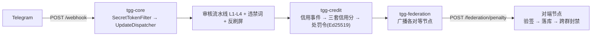

# Telegram 联邦智慧政务群组治理机器人（TGG）

一个基于 Telegram 的**群组治理机器人**：群主自治管群，联邦守住底线。Java 21 + Spring Boot 多模块工程。

> 定位：**开源项目**。开发者只交付代码 / 文档 / 许可证 / 免责声明，**不参与运营**；运营者自行申请资质并承担合规责任。

## 技术栈

| 项 | 取值 |
|---|---|
| 语言 / 构建 | Java 21 / Maven 多模块 |
| 框架 | Spring Boot **3.5.16**（**不可升 4.x**——4.x 用 Jackson 3，与 TelegramBots 的 Jackson 2 注解不兼容，会导致 `Update` 反序列化失败） |
| Bot 库 | TelegramBots **10.3.0**（坐标 `telegrambots-springboot-webhook-starter`，注意 `springboot` **无连字符**） |
| 持久化 | MySQL + Flyway（schema 由 Flyway 管理，JPA 侧 `ddl-auto: validate`） |
| 加解密 | 标识哈希 HMAC-SHA256（`IdHasher`）；处罚令签名 **Ed25519** |

## 模块结构

```
tgg-common      共享：领域模型、异常、工具（无业务逻辑）
tgg-core        模块一：Webhook 接入 / 中间件链 / 命令分发 / 限流 / 权限 / 审核 / 准入
tgg-credit      模块七：信用分体系（三套信用分 / 规则引擎 / 处罚令）
tgg-federation  模块八：联邦治理（对等节点广播 / 入站验签 / 跨群封禁 / 申诉）
tgg-app         Spring Boot 启动器（打成单一可运行 jar）
```

依赖单向：`tgg-app → tgg-federation → tgg-credit → tgg-core → tgg-common`。



## 快速开始

**前置**：JDK 21、Maven 3.9+、MySQL（库 `tgg`，`utf8mb4`）。

```bash
# 构建与全量测试（*IT 由 failsafe 在 verify 阶段执行）
JAVA_HOME=/opt/homebrew/opt/openjdk@21 mvn -B -ntp verify

# 运行（必须注入 TGG_WEBHOOK_SECRET，缺失即启动失败——刻意 fail-fast）
TGG_WEBHOOK_SECRET=<你的secret> \
JAVA_HOME=/opt/homebrew/opt/openjdk@21 \
java -jar tgg-app/target/tgg-app-0.1.0-SNAPSHOT.jar
```

## 配置（环境变量）

**必需**（缺失即启动失败，属刻意的 fail-fast）：

| 变量 | 说明 |
|---|---|
| `TGG_WEBHOOK_SECRET` | Webhook 的 `X-Telegram-Bot-Api-Secret-Token` 校验值。库**不**校验该头，由 `SecretTokenFilter` 常量时间比对实现 |
| `TGG_BOT_TOKEN` | Bot token。启用准入 / 联邦封禁等主动调用时需要 |

**数据库**：

| 变量 | 默认 |
|---|---|
| `TGG_DB_URL` | `jdbc:mysql://localhost:3306/tgg?...` |
| `TGG_DB_USER` / `TGG_DB_PASSWORD` | `tgg` / `tggdev`（**仅开发用**，生产必须覆盖） |

**各模块开关**（除注明外均**默认关闭**，不启用即整组组件不装配）：

| 变量 | 默认 | 说明 |
|---|---|---|
| `TGG_PERMISSION_ADMINS` | 空 | 群内管理员授权，格式 `<chatId>:<userId>[:role]`。**为空则所有管理命令对任何人不可用**（启动会 WARN） |
| `TGG_HASH_SALT` | 空 | 标识哈希用盐。不设会退回开发兜底盐（userId 空间小，固定盐可被枚举反推） |
| `TGG_FAILOVER_ENABLED` | `false` | Webhook 失效后降级长轮询 |
| `TGG_ADMISSION_ENABLED` | `false` | 入群验证 + 观察期；启用时要求 `TGG_BOT_TOKEN` |
| `TGG_AI_DEEPSEEK_ENABLED` | `false` | L3 云端审核；启用后**消息正文会发送至 DeepSeek**（详见 `PRIVACY.md`），缺 `TGG_DEEPSEEK_API_KEY` 即启动失败 |
| `TGG_CREDIT_ENABLED` | `false` | 模块七信用分；启用时缺 `TGG_CREDIT_PRIVATE_KEY`（Ed25519 PKCS#8 Base64 私钥）即启动失败 |
| `TGG_FEDERATION_ENABLED` | `false` | 模块八联邦；启用时 `TGG_FEDERATION_NODES`（`url\|公钥Base64`，逗号分隔）**为空即启动失败** |
| `TGG_FEDERATION_ADMINS` | 空 | 联邦管理员 userId（**全局**白名单，逗号分隔）；为空则 `/pending`·`/approve`·`/reject` 不可用 |

## 已实现 / 未实现

| 模块 | 状态 |
|---|---|
| 一 · 核心与基础设施（Webhook/分发/中间件/限流/RBAC/隐私管道/降级） | 已完成 |
| 三 · 群组管理（违禁词、反刷屏） | 已完成 |
| 四 · 准入与验证（入群验证、观察期） | 已完成（默认关闭） |
| 七 · 信用分体系（三套信用分、规则引擎、处罚令） | 已完成（默认关闭） |
| 八 · 联邦治理（对等广播、入站验签、跨群封禁、申诉） | 已完成（默认关闭） |
| 九 · AI 审核（L1 正则 + 四层流水线 + 复核队列 + L3 云端 / L2·L4 接入位） | 已完成（L2/L3/L4 默认关闭） |
| 五/六（收录）、十（通知审计）、十一（Web 后台）、十二（TON 担保） | **未开始** |

## 文档

| 文件 | 内容 |
|---|---|
| `docs/LESSONS.md` | 用真实代价换来的踩坑记录与交付自检清单（**动手前必读**） |
| `docs/DEPLOYMENT-VERIFICATION.md` | **必须公网部署后才能验的清单**（A–M 段）；每次报告"完成"时对照核销 |
| `docs/KNOWN-ISSUES.md` | 已开发模块的问题台账（逐条带 file:line 与处理记录） |
| `PRIVACY.md` | 隐私说明：消息原文零存储、日志脱敏、**第三方 AI 送什么/不送什么** |
| `docs/superpowers/specs/` | 各模块设计文档 |
| `AGENTS.md` | AI agent 在本仓库的行为纪律 |

## 许可

计划以 **AGPL-3.0** 发布；**`LICENSE` 文件尚待补充**（当前仓库内不存在该文件）。

## 免责声明

本项目仅提供软件。运营者须自行确保其运营行为符合所在地法律法规（含数据保护、金融合规等），并自行承担全部责任；开发者不参与运营、不提供担保。
