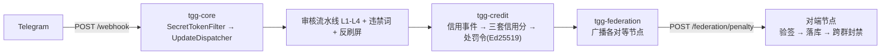

# Telegram 联邦智慧政务群组治理机器人（TGG）

一个基于 Telegram 的**群组治理机器人**：群主自治管群，联邦守住底线。Java 21 + Spring Boot 多模块工程。

> 定位：**开源项目**。开发者只交付代码 / 文档 / 许可证 / 免责声明，**不参与运营**；运营者自行申请资质并承担合规责任。

## 技术栈

| 项 | 取值 |
|---|---|
| 语言 / 构建 | Java 21 / Maven 多模块 |
| 框架 | Spring Boot **3.5.16**（**不可升 4.x**——4.x 用 Jackson 3，与 TelegramBots 的 Jackson 2 注解不兼容，会导致 `Update` 反序列化失败） |
| Bot 库 | TelegramBots **10.3.0**（坐标 `telegrambots-springboot-webhook-starter`，注意 `springboot` **无连字符**） |
| 持久化 | MySQL + Flyway（schema 由 Flyway 管理，JPA 侧 `ddl-auto: validate`） |
| 加解密 | 标识哈希 HMAC-SHA256（`IdHasher`）；处罚令签名 **Ed25519** |

## 模块结构

```
tgg-common      共享：领域模型、异常、工具（无业务逻辑）
tgg-core        模块一：Webhook 接入 / 中间件链 / 命令分发 / 限流 / 权限 / 审核 / 准入
tgg-credit      模块七：信用分体系（三套信用分 / 规则引擎 / 处罚令）
tgg-federation  模块八：联邦治理（对等节点广播 / 入站验签 / 跨群封禁 / 申诉）
tgg-listing     模块五/六：收录（群组收录 / 商家收录与保证金）
tgg-admin       模块十一：Web 后台（审批中心 REST API；无界面）
tgg-app         Spring Boot 启动器（打成单一可运行 jar）
```

依赖单向：`tgg-app` 依赖各业务模块，业务模块依赖 `tgg-core`，`tgg-core` 依赖 `tgg-common`
（即 `tgg-app → {federation, listing, admin, credit} → core → common`）；反向依赖不存在。



## 快速开始

**前置**：JDK 21、Maven 3.9+、MySQL。运行时用库 `tgg`（`utf8mb4`）；**测试连独立库 `tgg_test`**——
`mvn verify` 的集成测试会用 `deleteAll()` 重置数据，必须与运行库隔离（测试 URL 带 `createDatabaseIfNotExist=true`；
若用户无建库权限，需由管理员 `CREATE DATABASE tgg_test` 并 `GRANT ALL ON tgg_test.* TO 'tgg'@'localhost'`）。
详见 `docs/LESSONS.md` 坑 9。

```bash
# 构建与全量测试（*IT 由 failsafe 在 verify 阶段执行）
JAVA_HOME=/opt/homebrew/opt/openjdk@21 mvn -B -ntp verify

# 运行（必须注入 TGG_WEBHOOK_SECRET，缺失即启动失败——刻意 fail-fast）
TGG_WEBHOOK_SECRET=<你的secret> \
JAVA_HOME=/opt/homebrew/opt/openjdk@21 \
java -jar tgg-app/target/tgg-app-0.1.0-SNAPSHOT.jar
```

### 容器化运行（Docker / Compose）

```bash
export TGG_WEBHOOK_SECRET="$(openssl rand -hex 32)"   # 必需：缺失即启动失败
export MYSQL_ROOT_PASSWORD="<强随机>"
export TGG_DB_PASSWORD="<强随机>"
docker compose up -d --build
docker compose logs -f app     # 期望：末行 Started TggApplication in N.NNN seconds
```

`Dockerfile` 是多阶段构建（Maven 构建 → JRE 运行，**非 root**，uid 10001）；
`docker-compose.yml` 编排应用 + MySQL 8.4，数据库端口**只绑 `127.0.0.1`**。
✅ 已引入 **Actuator**（原文 §15.2「Actuator 锁定」）：容器 `HEALTHCHECK` 探 **`/actuator/health`**
（真实业务就绪，含 DB 连通性），不再只探端口——DB 不可达时它返回 503，容器随之判为 unhealthy。
只暴露 health，其余端点一律关闭（锁定值见 `tgg-app/src/main/resources/application.yml` 的 `management` 段）。
⚠️ CSP / HSTS **仍归反向代理层**（HSTS 必须由 TLS 终止方下发），见 `docs/DEPLOYMENT-VERIFICATION.md` S 段。
首次就绪仍建议以日志里那行 `Started TggApplication` 判断。详见 `docs/DEPLOYMENT-RUNBOOK.md` §0.2b。

### 服务器规格（部署前选型，**实测基线**）

下表是**实测**值（2026-09-19：本机 `java -jar` 真实进程 + `mysql:8.4` 容器），不是估算：

| 组件 | 空载占用 |
|---|---|
| 应用（JVM） | **约 314 MB** RSS（启动 3.7 s） |
| MySQL 8.4 | **约 527 MB** |
| 库数据（空库） | < 1 MB |
| 镜像 | 应用 **594 MB** + `mysql:8.4` **1.12 GB** |

**推荐**：应用与 MySQL 同机 → **2 vCPU / 4 GB 内存 / 20 GB 磁盘**；
MySQL 用托管实例（应用单独部署）→ **1 vCPU / 1 GB** 足够。

⚠️ **同机 2 GB 是紧的下限**：容器默认 `JAVA_OPTS=-XX:MaxRAMPercentage=75`（按 cgroup 限额算），
在 1 GB 机器上 JVM 会按 750 MB 上限规划，再加 MySQL 的约 530 MB 就越界了。

其余要求：Linux（x86_64 / arm64 皆可）+ Docker / Compose；
入站 **80 / 443**（Telegram webhook **强制 HTTPS**）、出站可达 `api.telegram.org`；
**建议 `TZ=UTC`**（免打扰时段按服务器时区解释，跨时区部署须统一，见 `docs/DEPLOYMENT-VERIFICATION.md` O-6 段）。
若要在服务器上**构建**（而非直接传 `tgg-app/target/*.jar`，66 MB），另需 JDK 21 + Maven 与约 2 GB 的 Maven 本地仓库空间。

### 依赖安全（SBOM + 漏洞扫描）

```bash
# 1) 生成 SBOM（mvn package 阶段自动产出，无需额外命令）
JAVA_HOME=/opt/homebrew/opt/openjdk@21 mvn -B -ntp -DskipTests package   # → target/bom.json

# 2) 查公开漏洞库（OSV）。退出码 0 = 无 HIGH/CRITICAL；1 = 有；3 = 网络失败（不得当作「无漏洞」）
python3 tools/security/scan_dependencies.py
```

扫描器与单测在 `tools/security/`；最近一次处置记录见 `docs/KNOWN-ISSUES.md`
「第六阶段 · 安全加固与容器化」。**0 命中不等于安全**——OSV 只收录公开漏洞。

### 持续集成（GitHub Actions）

`.github/workflows/ci.yml` 两个 job：

- **build** —— 起 MySQL 8.4 服务（库 `tgg_test`，与 `src/test/resources/application.yml` 严格一致），
  跑 `mvn -B -ntp verify`（**含 `*IT`**）。测试所需密钥写在测试配置里，CI **不注入任何 secret**。
- **dependency-scan** —— `mvn -DskipTests package` 产出 SBOM，再跑 `tools/security/scan_dependencies.py`
  查 OSV；退出码 1 即令流水线失败。

⚠️ 两条硬约束：必须带 MySQL（集成测试连独立库 `tgg_test`，**不是** H2，见 `docs/LESSONS.md`）；
必须用 `verify` 而非 `test`（否则 `*IT` 被静默跳过、得到假绿灯）。

## 配置（环境变量）

**必需**（缺失即启动失败，属刻意的 fail-fast）：

| 变量 | 说明 |
|---|---|
| `TGG_WEBHOOK_SECRET` | Webhook 的 `X-Telegram-Bot-Api-Secret-Token` 校验值。库**不**校验该头，由 `SecretTokenFilter` 常量时间比对实现 |
| `TGG_BOT_TOKEN` | Bot token。主动调用（准入验证、硬红线封禁、**收录下架通知私聊**、链接探针）需要；缺失时这些能力**各自显式降级并 WARN**，不静默 |

**数据库**：

| 变量 | 默认 |
|---|---|
| `TGG_DB_URL` | `jdbc:mysql://localhost:3306/tgg?...` |
| `TGG_DB_USER` / `TGG_DB_PASSWORD` | `tgg` / `tggdev`（**仅开发用**，生产必须覆盖） |

**各模块开关**（除注明外均**默认关闭**，不启用即整组组件不装配）：

| 变量 | 默认 | 说明 |
|---|---|---|
| `TGG_PERMISSION_ADMINS` | 空 | 群内管理员授权，格式 `<chatId>:<userId>[:role]`。**为空则所有管理命令对任何人不可用**（启动会 WARN） |
| `TGG_HASH_SALT` | 空 | 标识哈希用盐。不设会退回开发兜底盐（userId 空间小，固定盐可被枚举反推） |
| `TGG_FAILOVER_ENABLED` | `false` | Webhook 失效后降级长轮询 |
| `TGG_ADMISSION_ENABLED` | `false` | 入群验证 + 观察期；启用时要求 `TGG_BOT_TOKEN` |
| `TGG_AI_DEEPSEEK_ENABLED` | `false` | L3 云端审核；启用后**消息正文会发送至 DeepSeek**（详见 `PRIVACY.md`），缺 `TGG_DEEPSEEK_API_KEY` 即启动失败 |
| `TGG_CREDIT_ENABLED` | `false` | 模块七信用分；启用时缺 `TGG_CREDIT_PRIVATE_KEY`（Ed25519 PKCS#8 Base64 私钥）即启动失败 |
| `TGG_FEDERATION_ENABLED` | `false` | 模块八联邦；启用时 `TGG_FEDERATION_NODES`（`url\|公钥Base64`，逗号分隔）**为空即启动失败** |
| `TGG_FEDERATION_ADMINS` | 空 | 联邦管理员 userId（**全局**白名单，逗号分隔）；为空则 `/pending`·`/approve`·`/reject` 不可用 |
| `TGG_LISTING_ENABLED` | `false` | 模块五 · 群组收录；启用后 `/listing_add`·`/listing_list`·`/listing_appeal` 与每日链接验证任务才装配 |
| `TGG_LISTING_VERIFY_CRON` | `0 0 3 * * *` | 收录链接的定时验证 cron（到点扫描全库、连续 3 次失败转软删下架） |
| `TGG_LISTING_STALE_VERIFY_DAYS` | `3` | 收录条目超过该天数**未验证成功**时打 WARN（**本项目新增，非 V5.0 规格**）。抓的是「探测层持续不可用」——这类条目**不累加失败次数**，既有流程发现不了它。**只告警、不下架** |
| `TGG_MERCHANT_ENABLED` | `false` | 模块六 · 商家收录；启用后 `/merchant_*` 六个命令（apply / review / status / deposit / settle / exit）与保证金账本才装配 |
| `TGG_MERCHANT_REVIEWERS` | 空 | 资质复核人与保证金操作人 userId（**全局**白名单，逗号分隔）；为空则 `/merchant_review`·`/merchant_deposit` 对任何人不可用 |
| `TGG_MERCHANT_INITIAL_SCORE` | `500` | 商家入驻成功时写入的初始信用分（需同时 `TGG_CREDIT_ENABLED=true`，否则信用分不初始化） |
| `TGG_MODERATION_REVIEWERS` | 空 | 复核人 userId（**全局**白名单，逗号分隔）。为空则 `/review_list`·`/review_approve`·`/review_reject` 对任何人不可用 |
| `TGG_ADMIN_API_TOKEN` | 空 | 模块十一 · 审批中心后端的 `Bearer` 令牌。**为空则 `/admin/approvals` 端点整体不装配**（访问得 404）。审批人身份另由 `X-Operator-Id` 头携带，并须落在 `TGG_MODERATION_REVIEWERS` 白名单内 |
| `TGG_ADMIN_OVERDUE_REMIND_HOURS` / `..._ESCALATE_HOURS` | `24` / `72` | 审批待办超时提醒与升级阈值（**跳过硬红线**——它们由 §10.6 的 2h SLA 负责） |
| `TGG_OPENAPI_ENABLED` | `false` | 启用 Swagger / OpenAPI 文档（`/swagger-ui.html`、`/v3/api-docs`）。**默认关闭**——springdoc 会暴露全部端点清单与参数结构，属信息面；启用后**不要裸露公网**（见 `ADMIN-GUIDE.md`） |
| `TGG_MODERATION_SENSITIVE_GRADING_ENABLED` | `false` | 敏感话题分级（§10.5）：按群分级、受标签豁免。用 `/group_tag add\|remove\|list <标签>`（需群内管理员）管理。**可豁免话题**：`politics` / `intl_politics` / `religionism`；**不可豁免**：恐怖活动 / 极端主义 / 煽动战争 |

> 🟢 **想一次全开？** 用 **[`tools/deploy/all-on.env.example`](tools/deploy/all-on.env.example)**：10 个模块开关
> + 5 把必填密钥 + 5 份白名单，可直接 `set -a; . <该文件>; set +a` 或 `docker compose --env-file`。
> 本机已实测「全开可启动」：10 开关全开 → `Started TggApplication`；`/actuator/health`=UP、
> `/v3/api-docs`=200、`/admin/approvals` 无 token→401 / 白名单外→403。
> ⚠️ 两个必知的坑：① 值里含 `&`/`|` 的变量（`TGG_DB_URL`、`TGG_FEDERATION_NODES`）**必须加引号**——
> 否则 shell 静默把它们设成空，实测后果是应用**连到默认库 `tgg`**（不是你想连的那个）；
> ② 有 5 个开关打开即要求对应密钥（deepseek / credit / federation 缺失是**启动失败**，不是降级）。

> 📘 **模块五/六 的部署验证步骤**见 `docs/DEPLOYMENT-VERIFICATION.md` N 段与配套的 `docs/DEPLOYMENT-RUNBOOK.md`（后者含可照抄的命令、预期输出与失败排查表）。

## 已实现 / 未实现

| 模块 | 状态 |
|---|---|
| 一 · 核心与基础设施（Webhook/分发/中间件/限流/RBAC/隐私管道/降级） | 已完成 |
| 三 · 群组管理（违禁词、反刷屏） | 已完成 |
| 四 · 准入与验证（入群验证、观察期） | 已完成（默认关闭） |
| 七 · 信用分体系（三套信用分、规则引擎、处罚令） | 已完成（默认关闭） |
| 八 · 联邦治理（对等广播、入站验签、跨群封禁、申诉） | 已完成（默认关闭） |
| 九 · AI 审核（L1 正则 + 四层流水线 + 复核队列 + L3 云端 / L2·L4 接入位） | 已完成（L2/L3/L4 默认关闭） |
| **五/六 · 收录（群组收录、商家收录与保证金）** | **已完成（默认关闭）** |
| 十 · 通知与审计（三级分类 / 免打扰 / 全链路审计 / 保留策略 / 72h 泄露通报） | 已完成（默认关闭） |
| 十一 · Web 后台（审批中心后端 + **Vue 3 控制台**） | 已完成（默认关闭） |
| 十二 · TON 担保交易 | 未开始（链上不可达，既定非目标） |

## 文档

| 文件 | 内容 |
|---|---|
| `PRIVACY.md` | 隐私说明：消息原文零存储、日志脱敏、**第三方 AI 送什么/不送什么** |
| `COMPLIANCE.md` | 运营者合规清单：**开篇即列出本项目「没有做什么」**（无资金托管 / 无制裁筛查 / 无 KYC），再逐条对照 GDPR・AI Act・COPPA・Telegram 平台政策 |
| `DISCLAIMER.md` | 开发者免责声明：只提供软件、不参与运营、无担保、责任限制 |
| `TERMS.md` | 服务条款**模板**（含占位符，运营者须按自身部署与法域改写并公开） |
| `CONTRIBUTING.md` | 贡献指南：环境、测试纪律（含「只跑 `mvn test` 会静默跳过全部 IT」）、提交前自检 |
| `Dockerfile` / `docker-compose.yml` | 容器化交付物：多阶段构建 + 非 root 运行；应用 + MySQL 单机编排 |
| `tools/security/scan_dependencies.py` | 依赖漏洞扫描器（读 SBOM 查 OSV；退出码可接 CI）；单测在同目录 |
| `ARCHITECTURE.md` | **架构文档**：模块划分与依赖方向、一次更新的生命周期、关键设计决策、数据模型、扩展接缝 |
| `SECURITY.md` | **安全文档**：认证/授权/隐私/输入安全/密钥管理/审计/供应链/部署加固，并明列**未实现**项 |
| `USER-GUIDE.md` | **用户手册**：群主与成员的 Bot 使用指南（29 个命令、权限、通知、隐私） |
| `ADMIN-GUIDE.md` | **管理员手册**：审批中心 REST API、复核流程、运营者日常清单 |
| `DPIA-TEMPLATE.md` | **数据保护影响评估模板**（GDPR 第 35 条）；含本项目实际处理的数据清单，运营者填写并签署 |
| `k8s/` | Kubernetes 清单（Deployment / Service / Ingress / ConfigMap / Secret 模板）+ 应用说明 |
| `frontend/` | **Web 后台控制台**（Vue 3 + TypeScript + Element Plus）：审批中心的待办列表 / 详情 / 裁决 / 统计。独立构建为静态站点，经反向代理调后端 `/admin/*`。详见 `frontend/README.md` |

## 许可

**AGPL-3.0**（GNU Affero General Public License v3.0）—— 全文见仓库根目录 [`LICENSE`](LICENSE)。

## 免责声明

本项目仅提供软件。运营者须自行确保其运营行为符合所在地法律法规（含数据保护、金融合规等），并自行承担全部责任；开发者不参与运营、不提供担保。
